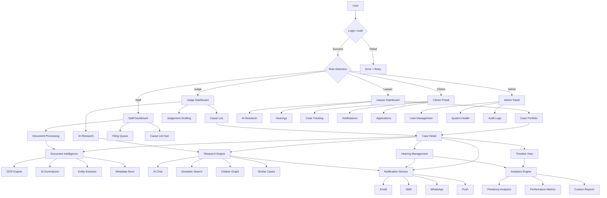
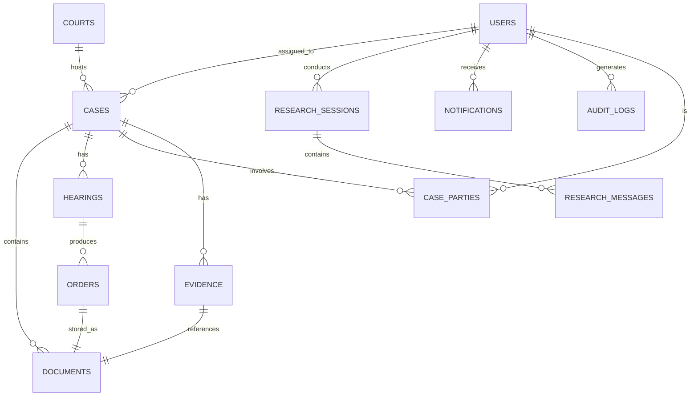

# CaseMind — Enterprise AI-Powered Legal Platform
## Complete Software Architecture & Product Framework

> **Document Classification:** Architecture Blueprint v1.0  
> **Status:** Awaiting Approval  
> **Prepared by:** Principal Software Architect  
> **Target Deployment:** Supreme Court of India & Subordinate Courts  
> **Date:** July 2026

---

# Table of Contents

1. [Executive Summary](#1-executive-summary)
2. [Product Vision](#2-product-vision)
3. [User Personas](#3-user-personas)
4. [Information Architecture](#4-information-architecture)
5. [Complete Screen Inventory](#5-complete-screen-inventory)
6. [User Flow Diagrams](#6-user-flow-diagrams)
7. [Application Flow Diagram](#7-application-flow-diagram)
8. [Folder Structure](#8-folder-structure)
9. [Component Architecture](#9-component-architecture)
10. [Design System](#10-design-system)
11. [Theme & Design Language](#11-theme--design-language)
12. [State Management Plan](#12-state-management-plan)
13. [Routing Structure](#13-routing-structure)
14. [API Layer](#14-api-layer)
15. [Database Entity Planning](#15-database-entity-planning)
16. [Dummy Data Strategy](#16-dummy-data-strategy)
17. [Future Features](#17-future-features)
18. [Coding Standards](#18-coding-standards)
19. [Development Roadmap](#19-development-roadmap)
20. [Final Development Checklist](#20-final-development-checklist)

---

# 1. Executive Summary

## What is CaseMind?

CaseMind is an enterprise-grade, AI-powered legal intelligence platform purpose-built for the Indian judicial ecosystem. It unifies document intelligence, AI-assisted legal research, case lifecycle management, citizen access services, judicial workflow automation, and deep analytics into a single, coherent platform — architected at the scale and security standards demanded by the Supreme Court of India and its subordinate courts.

CaseMind is not a simple case tracker. It is a **cognitive legal operating system** that amplifies the capacity of every stakeholder in the judicial process: judges who need synthesized research at speed, lawyers who need citation-accurate precedents, court staff who manage thousands of filings, citizens who deserve transparent access to their cases, and administrators who need system-level visibility.

## Problems CaseMind Solves

| Problem | Today's Reality | CaseMind Solution |
|---|---|---|
| Judicial Backlog | 5 crore+ pending cases, manual tracking | AI-prioritized docket management, automated scheduling |
| Legal Research Inefficiency | Hours spent searching databases manually | Semantic AI search with citation mapping, instant summaries |
| Document Management | Paper-based, siloed, OCR-lacking | Unified intelligent document repository with AI extraction |
| Citizen Opaqueness | No real-time case status, complicated portals | Simplified citizen portal with live timeline and notifications |
| Inconsistent Judicial Workflow | Varies by judge/court | Standardized AI-assisted workflow with templated orders |
| Data Silos | NCLT, District Court, HC systems don't talk | Unified API layer with cross-system federation |
| Analytics Blindspot | No macro-visibility into judicial performance | Advanced analytics dashboards for policy makers |

## Target Users

- **Judges** (District, High Court, Supreme Court Justices)
- **Advocates / Lawyers** (Senior Counsel, Junior Associates)
- **Court Registry Staff** (Filing clerks, Section officers)
- **Citizens / Litigants** (Direct access, no legal intermediary required)
- **Platform Administrators** (IT Admins, CIO-level officials)
- **Government Legal Officers** (Public Prosecutors, AG teams)

## Core Objectives

1. **Reduce per-case research time** by 70% using semantic AI search and auto-citation
2. **Digitize 100% of document workflows** with OCR, entity extraction, and metadata indexing
3. **Provide real-time case transparency** to citizens without requiring legal literacy
4. **Standardize and automate judicial workflows** to reduce procedural delays
5. **Generate actionable analytics** for judicial reform and policy planning
6. **Ensure enterprise-grade security** compliant with IT Act 2000, Data Protection Bill 2023, and MeitY cloud policy

## Why This Architecture Was Chosen

### Technology Stack Decision: React + Next.js + TypeScript

The platform demands:
- **Server-Side Rendering (SSR)** for SEO on public citizen portals
- **Static Site Generation (SSG)** for performance on read-heavy analytics
- **React Server Components** for streaming large document lists
- **TypeScript** for type-safety at enterprise scale (prevents runtime errors in legal-critical flows)
- **Tailwind CSS** for consistent design-system implementation across a large team

### Architectural Patterns

- **Feature-Sliced Design (FSD)** for folder structure — prevents monolithic component collapse
- **Flux/Redux Toolkit** for predictable global state in multi-user judicial contexts
- **React Query (TanStack Query)** for server state — caching, pagination, background refresh
- **Zod** for schema validation — critical for legal document forms
- **Optimistic UI** for high-frequency staff workflows

---

# 2. Product Vision

## The Complete Vision

CaseMind envisions a future where the Indian judiciary operates at the speed of information, not the speed of paperwork. Every judicial actor — from a Supreme Court Justice to a first-generation litigant from rural Bihar — should have access to the right information, at the right time, in the right format.

## Module-by-Module Vision

### 2.1 AI Legal Research Engine
The research engine is the intellectual core of CaseMind. Powered by a large language model fine-tuned on Indian case law (Supreme Court, High Courts, Tribunals), it provides:

- **Natural language querying**: "What is the precedent on marital rape in India?" returns structured results with citations
- **Semantic similarity search**: Not keyword-based, but conceptually driven — finding cases by legal doctrine, not just words
- **Citation graph traversal**: Automatically maps how a case has been cited, overruled, or distinguished
- **Parallel case finding**: Given a current case, finds all historically similar matters
- **Draft assistance**: Helps lawyers draft arguments by surfacing relevant precedents in context

### 2.2 Document Intelligence
Every legal document is a structured artifact with latent information. CaseMind extracts that structure:

- **Multi-format OCR**: PDF, TIFF, scanned images, handwritten notes (with confidence scoring)
- **Legal entity extraction**: Automatically identifies parties, judges, dates, sections cited, relief granted
- **Intelligent summarization**: 50-page judgement → executive 5-point summary in seconds
- **Chronological reconstruction**: Orders, applications, replies automatically mapped to a case timeline
- **Cross-document linking**: When a new document references a case number or citation, CaseMind auto-links it

### 2.3 Case Management
A complete lifecycle management system:

- End-to-end case tracking from filing to final order
- Multi-court, multi-bench handling
- Evidence vault with chain-of-custody tracking
- Hearing scheduler with judge availability integration
- Automated cause list generation
- Order drafting with AI assistance

### 2.4 Citizen Portal
A human-centred public interface requiring zero legal knowledge:

- **Plain language case status** ("Your case is next scheduled for 15 Aug 2026 — Hearing on Merits")
- **Push notifications** via SMS/Email/WhatsApp for all case events
- **Document download** (certified copies of orders)
- **Online application filing** (bail, adjournment, interim relief)
- **Lawyer-citizen secure messaging** with court oversight
- **Multilingual support** (22 scheduled languages)

### 2.5 Judicial Workflow
Built exclusively for judicial officers:

- **AI-assisted drafting** of orders and judgements
- **Private notes** and observations management (Judge's Notebook)
- **Precedent suggestions** surfaced contextually during hearing
- **Recusal management** workflow
- **Inter-bench communication** protocol
- **Sentence computation** tools for criminal matters

### 2.6 Analytics & Reporting
Institutional intelligence layer:

- **Case pendency heatmaps** by court, district, category
- **Judge performance metrics** (case clearance ratio, average disposal time)
- **Lawyer appearance analytics**
- **Category-wise case trend analysis**
- **Prediction: Expected disposal timeline** using historical data
- **Policy dashboards** for High Court registrars and Law Ministry

### 2.7 Future AI Capabilities
- Real-time transcription of court proceedings
- AI-generated draft judgements (for judge review only)
- Predictive bail outcome models
- Fraud detection in document submissions
- Cross-lingual semantic search (vernacular queries → English precedents)

---

# 3. User Personas

## 3.1 Persona: The Judge

### Profile
- **Name (Archetype):** Justice Ramachandra Iyengar
- **Role:** High Court Judge (Civil Division)
- **Age:** 52 | **Tech Comfort:** Moderate | **Daily Case Load:** 40–60 matters

### Goals
- Deliver well-reasoned, citation-backed judgements efficiently
- Clear the pending docket without sacrificing quality
- Access relevant precedents without relying on law clerks for every query
- Maintain a structured judicial notebook and order tracking system

### Permissions
| Resource | Access Level |
|---|---|
| All Cases (assigned bench) | Full Read/Write |
| Judgement Drafting | Full |
| AI Research Engine | Full |
| Analytics (own bench) | Read |
| Citizen Portal | Admin View |
| Other Judges' Data | Denied |
| System Configuration | Denied |

### Dashboard Sections
- Today's Cause List (prioritized, interactive)
- AI Research Quick-Launch
- Pending Dictation / Draft Orders
- Judge's Notebook
- Recent AI Summaries
- Case Statistics (own bench)

### Workflow
1. Morning: Reviews AI-generated cause list summary
2. During Hearing: AI surfaces relevant precedents in sidebar
3. Post-Hearing: Dictates observations into AI-enhanced notes
4. Drafting: AI proposes order structure; Judge reviews and finalizes
5. Signature & Dispatch: Digital signature → automated document dispatch

### Key Features Used
- AI Chat Research, Semantic Case Search
- Document Summarizer, Entity Viewer
- Judgement Drafter, Precedent Sidebar
- Judge's Notebook, Recusal Manager

### Pain Points Solved
- Eliminates hours of manual law library research
- Reduces dependency on clerks for citation lookup
- Standardizes order formats across benches
- Provides searchable, structured notes instead of handwritten diaries

---

## 3.2 Persona: The Lawyer / Advocate

### Profile
- **Name (Archetype):** Adv. Priya Mehta (Senior Counsel)
- **Age:** 38 | **Tech Comfort:** High | **Active Cases:** 120+

### Goals
- Win cases with superior research and argument preparation
- File documents efficiently without visiting court registry
- Track all hearings across multiple courts in one place
- Provide transparent updates to clients without manual effort

### Permissions
| Resource | Access Level |
|---|---|
| Own Cases | Full |
| Other Lawyers' Cases | Denied |
| AI Research Engine | Full |
| Document Upload (own cases) | Full |
| Citizen Notifications | Trigger (own cases) |
| Analytics | Own portfolio only |
| System Configuration | Denied |

### Workflow
1. **Case Intake:** Onboard new client, create case, upload initial documents
2. **Research:** AI chat to find precedents, build argument skeleton
3. **Filing:** Upload pleadings, applications; receive filing numbers
4. **Hearing Prep:** Pull AI summary of opposing arguments, cite counter-precedents
5. **Post-Hearing:** Log notes, review judge's observations, plan next steps
6. **Client Update:** Auto-notify client of hearing outcome

### Pain Points Solved
- Single dashboard across all courts replaces 15 browser tabs
- AI research replaces 4-hour manual search sessions
- Automated client notifications reduce phone interruptions
- Document AI extracts key clauses from bulky contracts instantly

---

## 3.3 Persona: The Court Registry Staff

### Profile
- **Name (Archetype):** Ramesh Patil, Section Officer
- **Age:** 45 | **Tech Comfort:** Low–Moderate | **Daily Filings:** 200+

### Goals
- Process filings accurately and quickly
- Generate cause lists without errors
- Track document movement and chain of custody
- Manage certified copy requests efficiently

### Permissions
| Resource | Access Level |
|---|---|
| All Cases (assigned court) | Read + Administrative Write |
| Document Upload & Metadata | Full |
| Cause List Generation | Full |
| AI Research | Read-only |
| Judgement Drafting | Denied |
| Analytics | Court-level Read |
| User Management | Denied |

### Workflow
1. **Morning:** Generate and publish AI-assisted cause list
2. **During Day:** Process new filings, assign case numbers, upload documents
3. **Post-Filing:** Trigger AI OCR + metadata extraction on uploaded documents
4. **End of Day:** Update case statuses, generate disposal statistics
5. **Weekly:** Produce pendency reports for registrar

### Pain Points Solved
- AI auto-fills metadata from uploaded documents (no re-keying)
- Cause list generator uses AI to optimize scheduling
- Document tracking eliminates "file not found" situations
- Automated certified copy fulfillment reduces queue

---

## 3.4 Persona: The Citizen / Litigant

### Profile
- **Name (Archetype):** Sunita Devi (Litigant, property dispute case)
- **Age:** 55 | **Tech Comfort:** Low | **Languages:** Hindi, basic English

### Goals
- Know when her next hearing is without calling a lawyer
- Understand what happened in the last hearing in plain language
- Receive immediate notification if her case is called
- Download the last court order when needed

### Permissions
| Resource | Access Level |
|---|---|
| Own Cases Only | Read-only |
| Case Timeline | Read |
| Order Downloads | Read (public orders) |
| Document Upload | Application forms only |
| AI Research | Denied |
| Internal Case Notes | Denied |
| Contact Lawyer | Messaging only |

### Workflow
1. **Registration:** OTP-based mobile registration, link case by CNR number
2. **Dashboard:** See case status in plain Hindi/English
3. **Notifications:** Push/SMS alert when hearing is updated
4. **Timeline:** Visual timeline of all events in the case
5. **Order Download:** One-tap download of public orders
6. **Application Filing:** Fill guided form for adjournment/certified copy request

### Pain Points Solved
- No longer needs a middleman to know their case status
- Plain language descriptions eliminate confusion
- Mobile-first design works on basic smartphones
- Multi-language support enables access for rural users

---

## 3.5 Persona: The Platform Administrator

### Profile
- **Name (Archetype):** Vikram Singh, IT Director (NIC)
- **Age:** 40 | **Tech Comfort:** Expert | **Scope:** Platform-wide

### Goals
- Ensure 99.9% uptime for mission-critical legal processes
- Manage user roles, permissions, and audit trails
- Monitor AI model performance and accuracy
- Ensure data compliance with Indian data protection laws

### Permissions
| Resource | Access Level |
|---|---|
| All System Modules | Full Admin |
| User Management | Full |
| Role Configuration | Full |
| Audit Logs | Full |
| AI Model Management | Full |
| Database Configuration | Full |
| Security & Compliance | Full |

### Workflow
1. **User Provisioning:** Create/suspend user accounts, assign court-specific roles
2. **Monitoring:** Real-time system health dashboard, API latency monitoring
3. **Audit:** Review all document access, AI query, and case modification logs
4. **AI Management:** Monitor AI accuracy scores, retrain triggers, model versioning
5. **Compliance:** Generate DPDPA compliance reports, data export/deletion requests

---

# 4. Information Architecture

## 4.1 Navigation Hierarchy

```
CaseMind Platform
|
|-- Dashboard
|   |-- Today's Summary
|   |-- Quick Actions
|   |-- AI Recommendations
|   `-- Notifications Feed
|
|-- Documents
|   |-- My Documents
|   |-- Upload Document
|   |-- OCR Processing Queue
|   |-- AI Summary View
|   |-- Metadata Editor
|   `-- Extracted Entities
|
|-- Legal Research
|   |-- AI Chat (Research Assistant)
|   |-- Citation Search
|   |-- Semantic Search
|   |-- Similar Judgements
|   `-- Research History
|
|-- Cases
|   |-- Active Cases
|   |-- Closed Cases
|   |-- Archived Cases
|   |-- Case Detail View
|   |   |-- Overview
|   |   |-- Parties
|   |   |-- Documents
|   |   |-- Hearings
|   |   |-- Orders
|   |   |-- Evidence
|   |   `-- Timeline
|   `-- New Case
|
|-- Hearings
|   |-- Calendar View
|   |-- List View
|   |-- Cause List
|   `-- Hearing Timeline
|
|-- Analytics
|   |-- Overview Dashboard
|   |-- Case Statistics
|   |-- Pendency Analysis
|   |-- Performance Metrics
|   `-- Custom Reports
|
|-- Citizen Portal
|   |-- Track Case
|   |-- Case Timeline
|   |-- Order Downloads
|   |-- File Application
|   `-- Notifications
|
|-- Notifications
|   |-- All Notifications
|   |-- Hearing Alerts
|   |-- Document Updates
|   `-- System Messages
|
`-- Settings
    |-- Profile
    |-- Preferences
    |-- Notifications
    |-- Security
    `-- Administration (Admin only)
```

## 4.2 Section Explanations

| Section | Description | Primary Users | Key Actions |
|---|---|---|---|
| **Dashboard** | Personalized home — role-aware widgets showing today's priorities | All | Navigate, Review, Quick-act |
| **Documents** | Central document vault with AI processing pipeline | All (role-filtered) | Upload, Summarize, Extract, Link |
| **Legal Research** | AI-powered precedent and citation engine | Judge, Lawyer | Chat, Search, Cite, Save |
| **Cases** | Complete case lifecycle management | Judge, Lawyer, Staff | Create, Track, Update, Close |
| **Hearings** | Calendar and cause-list management | Judge, Staff, Lawyer | Schedule, Reschedule, Minutes |
| **Analytics** | Institutional intelligence dashboards | Judge, Admin, Staff | View, Filter, Export |
| **Citizen Portal** | Simplified public access layer | Citizen | Track, Download, Apply, Notify |
| **Notifications** | Centralized alert and update center | All | Read, Acknowledge, Configure |
| **Settings** | Profile, security, and admin configuration | All (scoped) | Configure, Manage, Audit |

---

# 5. Complete Screen Inventory

## 5.1 Authentication Screens

### `/login` — Login Page
| Property | Detail |
|---|---|
| **Purpose** | Authenticate all user types into the platform |
| **Main Components** | Logo, Role selector, Email/ID field, Password field, OTP option, SSO button |
| **Actions** | Login, Forgot Password, Request OTP, SSO (Google/LDAP) |
| **Navigation** | Dashboard (on success), Forgot Password |
| **Data Used** | User credentials, JWT token, Role metadata |

### `/forgot-password` — Password Recovery
| Property | Detail |
|---|---|
| **Purpose** | Recover account access via email/OTP |
| **Main Components** | Email input, OTP verification, New password form |
| **Actions** | Send OTP, Verify, Reset Password |
| **Navigation** | Login (on success) |
| **Data Used** | User email, OTP token |

### `/citizen/register` — Citizen Registration
| Property | Detail |
|---|---|
| **Purpose** | Register citizens with mobile OTP, no email required |
| **Main Components** | Mobile number, OTP field, CNR number input, Name, Language preference |
| **Actions** | Send OTP, Verify, Register, Link Case |
| **Navigation** | Citizen Dashboard |
| **Data Used** | Mobile number, CNR number, User profile |

---

## 5.2 Dashboard Screens

### `/dashboard` — Main Dashboard
| Property | Detail |
|---|---|
| **Purpose** | Role-aware home screen — the nerve center of each user's workday |
| **Main Components** | Hero greeting, Case summary stats, Hearing calendar widget, Recent Cases list, AI Recommendations panel, Quick Actions grid, Notifications sidebar, Activity feed |
| **Actions** | Navigate to any section, Trigger AI research, View notifications, Open case |
| **Navigation** | All major sections |
| **Data Used** | User profile, Today's hearings, Recent cases, AI queue, Notifications feed |

### `/dashboard/judge` — Judge-Specific Dashboard
| Property | Detail |
|---|---|
| **Purpose** | Judge-optimized view with cause list and research tools |
| **Main Components** | Today's Cause List (interactive), Pending Draft Orders, AI Research Sidebar, Bench Statistics, Judge's Notebook widget |
| **Actions** | Launch AI research, Open draft, Review cause list, Open notebook |
| **Navigation** | Cases, Research, Hearing |
| **Data Used** | Assigned bench cases, Today's hearings, Draft orders, Bench metrics |

---

## 5.3 Document Screens

### `/documents` — Document Library
| Property | Detail |
|---|---|
| **Purpose** | Searchable repository of all case-linked documents |
| **Main Components** | Search & filter bar, Document grid/list toggle, Sort controls, Document cards (thumbnail, metadata, status badges), Upload FAB |
| **Actions** | Search, Filter (by case/date/type/status), Upload, Preview, Download, Share |
| **Navigation** | Upload, Document Detail, Case linked |
| **Data Used** | Document metadata, Processing status, Case links, User access level |

### `/documents/upload` — Document Upload
| Property | Detail |
|---|---|
| **Purpose** | Drag-and-drop uploader with immediate AI processing trigger |
| **Main Components** | Drop zone, File picker, Case linker dropdown, Document type selector, Language selector, Upload progress bar, Processing status tracker |
| **Actions** | Drag-drop, Browse, Select Case, Set Type, Upload, Cancel, Retry |
| **Navigation** | Document Detail (after upload) |
| **Data Used** | File blob, Case ID, Document type, Language, Upload metadata |

### `/documents/:id` — Document Detail
| Property | Detail |
|---|---|
| **Purpose** | Full document viewer with AI analysis panels |
| **Main Components** | PDF/Image viewer (paged), AI Summary panel, Extracted Entities sidebar, Metadata table, Citation links, Related documents list, Action toolbar |
| **Actions** | View pages, Highlight, Annotate, Copy citation, Link to case, Download, Delete |
| **Navigation** | Documents, Related Case, Research with this doc |
| **Data Used** | Document content, OCR text, AI summary, Entities JSON, Metadata, Citation map |

### `/documents/:id/ocr` — OCR Processing View
| Property | Detail |
|---|---|
| **Purpose** | Review and correct OCR output before AI processing |
| **Main Components** | Side-by-side image vs text, Confidence score indicators, Correction inline editor, Page navigator |
| **Actions** | Review, Correct text, Accept, Reject, Re-OCR |
| **Navigation** | Document Detail |
| **Data Used** | Raw OCR output, Confidence scores, Original image |

---

## 5.4 Legal Research Screens

### `/research` — Research Home
| Property | Detail |
|---|---|
| **Purpose** | Entry point to all AI research tools |
| **Main Components** | Quick search hero, Recent sessions list, Pinned research, Tool cards (Chat, Citation, Semantic, Similar Cases) |
| **Actions** | Start new session, Resume session, Open tool |
| **Navigation** | Research Chat, Citation Search, Semantic Search, Similar Cases |
| **Data Used** | Recent sessions, User search history |

### `/research/chat` — AI Research Chat
| Property | Detail |
|---|---|
| **Purpose** | Conversational AI for legal research with full citation support |
| **Main Components** | Chat message thread, Message input with formatting, Citation chips, Source documents panel, Session history sidebar, Export button |
| **Actions** | Ask question, Refine query, Pin citation, Open source doc, Export research, Start new session, Save session |
| **Navigation** | Document Detail (source), Case linked |
| **Data Used** | Conversation history, AI responses, Cited case metadata, Research session |

### `/research/semantic` — Semantic Search
| Property | Detail |
|---|---|
| **Purpose** | Concept-based search across the full judgement corpus |
| **Main Components** | Natural language query input, Filter panel (court, year, category), Results list with relevance scores, Result card (case name, excerpt, relevance badge), Preview drawer |
| **Actions** | Search, Apply filters, Preview, Open full case, Cite, Save |
| **Navigation** | Case Detail, Research Chat |
| **Data Used** | Embeddings index, Case metadata, Filter parameters |

### `/research/citations` — Citation Search
| Property | Detail |
|---|---|
| **Purpose** | Find cases by citation string or navigate citation networks |
| **Main Components** | Citation input, Citation graph visualization, Citing cases list, Cited by list, Treatment tags (followed/distinguished/overruled) |
| **Actions** | Enter citation, Navigate graph, Filter by treatment, Open case |
| **Navigation** | Case Detail |
| **Data Used** | Citation registry, Citation treatment metadata |

### `/research/similar` — Similar Judgements Finder
| Property | Detail |
|---|---|
| **Purpose** | Given a case or legal question, find most similar decided matters |
| **Main Components** | Input (case number or text), Similarity results grid, Match score bars, Comparison drawer |
| **Actions** | Input case, Search, Compare, Open, Save |
| **Navigation** | Case Detail |
| **Data Used** | Embedding model, Case corpus |

---

## 5.5 Case Management Screens

### `/cases` — Case List
| Property | Detail |
|---|---|
| **Purpose** | Overview of all accessible cases with filtering and search |
| **Main Components** | Search bar, Filter panel (status/court/category/date), Sort controls, Case cards grid, Pagination |
| **Actions** | Search, Filter, Sort, Open Case, Create New Case |
| **Navigation** | Case Detail, New Case |
| **Data Used** | Cases list, Metadata, Status, Parties |

### `/cases/new` — New Case Creation
| Property | Detail |
|---|---|
| **Purpose** | Multi-step form to register a new case |
| **Main Components** | Stepper (Case Info > Parties > Documents > Review), Form fields with validation, Party search/add, Document upload, AI case type suggestion |
| **Actions** | Fill form, Add parties, Upload docs, Submit, Save draft |
| **Navigation** | Case Detail (on success) |
| **Data Used** | Case metadata, Party information, Initial documents |

### `/cases/:id` — Case Detail
| Property | Detail |
|---|---|
| **Purpose** | Complete case profile — the single source of truth for a matter |
| **Main Components** | Case header (number, title, status, bench), Tab bar (Overview/Parties/Documents/Hearings/Orders/Evidence/Timeline), Content area per tab, AI Insights panel (collapsible), Action toolbar |
| **Actions** | View all tabs, Upload document, Schedule hearing, Add note, Set status, Generate order |
| **Navigation** | All sub-tabs, Research, Hearing Detail |
| **Data Used** | Full case entity, Related parties, Documents, Hearings, Orders, Evidence |

### `/cases/:id/timeline` — Case Timeline
| Property | Detail |
|---|---|
| **Purpose** | Visual chronological history of all case events |
| **Main Components** | Vertical timeline component, Event cards (hearing/order/filing/note), Date filter, AI summary of timeline |
| **Actions** | Filter events, View document linked to event, Add manual event |
| **Navigation** | Document Detail, Hearing Detail |
| **Data Used** | Case event log, Linked documents, Hearing history |

---

## 5.6 Hearing Screens

### `/hearings` — Hearing Calendar
| Property | Detail |
|---|---|
| **Purpose** | Calendar and list view of all scheduled hearings |
| **Main Components** | Monthly/Weekly/Day calendar, Hearing list panel, Quick filters (by court/bench/status), Hearing card (case number, title, time, courtroom), Today's cause list button |
| **Actions** | Navigate calendar, View hearing, Edit, Cancel, Reschedule, Generate cause list |
| **Navigation** | Hearing Detail, Case Detail |
| **Data Used** | Hearing schedule, Case metadata, Courtroom assignments, Judge availability |

### `/hearings/:id` — Hearing Detail
| Property | Detail |
|---|---|
| **Purpose** | Full hearing record with notes, orders, and proceedings |
| **Main Components** | Hearing header (case, date, courtroom, bench), Appearing counsel list, AI-suggested precedents, Proceedings notes editor, Orders section, Next hearing scheduler |
| **Actions** | Add note, Attach document, Dictate order, Schedule next, Mark attended |
| **Navigation** | Case Detail, Document Detail |
| **Data Used** | Hearing entity, Counsel data, AI suggestions, Notes, Orders |

### `/hearings/causelist` — Cause List Generator
| Property | Detail |
|---|---|
| **Purpose** | AI-optimized daily cause list generation for court staff |
| **Main Components** | Date picker, Court selector, Draggable matter list, AI optimization suggestions, Preview, Print/publish controls |
| **Actions** | Select date/court, Drag reorder, Accept AI order, Preview, Publish, Print |
| **Navigation** | Hearing Detail |
| **Data Used** | All hearings for date/court, Judge preferences, Urgency flags |

---

## 5.7 Analytics Screens

### `/analytics` — Analytics Overview
| Property | Detail |
|---|---|
| **Purpose** | Executive dashboard with macro judicial metrics |
| **Main Components** | KPI cards row (total cases, disposed, pending, avg disposal days), Trend line charts, Category distribution pie chart, Court-wise heatmap, Top cases list |
| **Actions** | Filter by date/court, Drill down, Export, Share |
| **Navigation** | Detailed Analytics sections |
| **Data Used** | Aggregated case data, Disposal metrics, Court data |

### `/analytics/pendency` — Pendency Analysis
| Property | Detail |
|---|---|
| **Purpose** | Deep-dive into pending cases with aging analysis |
| **Main Components** | Aging funnel chart, Category pendency bars, District heatmap, Old-case top list (5+ year pending), Filters |
| **Actions** | Filter, Drill by district/category, Export report |
| **Navigation** | Cases (filtered) |
| **Data Used** | Pendency metrics, Case ages, Court/category dimensions |

### `/analytics/performance` — Performance Metrics
| Property | Detail |
|---|---|
| **Purpose** | Judicial and institutional performance analytics |
| **Main Components** | Judge clearance ratio cards, Monthly disposal trend, Category performance matrix, Bottleneck identification chart |
| **Actions** | Filter by bench/period, Compare, Export |
| **Navigation** | None |
| **Data Used** | Disposal data, Bench assignments, Date ranges |

---

## 5.8 Citizen Portal Screens

### `/citizen` — Citizen Home
| Property | Detail |
|---|---|
| **Purpose** | Welcoming public-facing portal entry point |
| **Main Components** | Hero with case search bar (CNR number), Feature tiles (Track/Download/Apply/Notify), Language selector, Help section |
| **Actions** | Enter CNR, Select language, Navigate features |
| **Navigation** | Track Case, Register |
| **Data Used** | None (public page) |

### `/citizen/track` — Case Tracking
| Property | Detail |
|---|---|
| **Purpose** | Public case status view — no login required for basic info |
| **Main Components** | Case status card (number, title, next date, stage), Party names, Last order summary, Timeline preview, Lawyer info, Subscribe to updates button |
| **Actions** | Search CNR, Subscribe, Download last order, View timeline |
| **Navigation** | Citizen Timeline, Order Download, Register |
| **Data Used** | Public case data, Next hearing, Last order (public fields only) |

### `/citizen/dashboard` — Citizen Dashboard (logged in)
| Property | Detail |
|---|---|
| **Purpose** | Personalized dashboard for registered citizens |
| **Main Components** | Linked cases list, Next hearing cards, Notification feed, Unread orders badge, Quick actions |
| **Actions** | View case, Download order, File application, Message lawyer |
| **Navigation** | Case Timeline, Applications, Notifications |
| **Data Used** | Linked cases, Hearings, Notifications, Orders |

### `/citizen/applications` — Application Filing
| Property | Detail |
|---|---|
| **Purpose** | Guided form for filing court applications without a lawyer |
| **Main Components** | Application type selector (adjournment/certified copy/bail application), Guided step-by-step form, Document attachment, Submission confirmation, Tracking ID |
| **Actions** | Select type, Fill form, Attach docs, Submit, Track application |
| **Navigation** | Citizen Dashboard |
| **Data Used** | Case info, Citizen profile, Application form fields |

---

## 5.9 Settings Screens

### `/settings/profile` — Profile Settings
| Property | Detail |
|---|---|
| **Purpose** | Manage personal profile information |
| **Main Components** | Avatar upload, Name, Contact info, Bar number (lawyers), Digital signature upload (judges), Language preference |
| **Actions** | Edit, Save, Upload signature |
| **Navigation** | None |
| **Data Used** | User profile entity |

### `/settings/security` — Security Settings
| Property | Detail |
|---|---|
| **Purpose** | Password, 2FA, session management |
| **Main Components** | Change password form, 2FA toggle (TOTP), Active sessions list, API key management (lawyers) |
| **Actions** | Change password, Enable/disable 2FA, Revoke session, Generate API key |
| **Navigation** | None |
| **Data Used** | Auth settings, Session tokens |

### `/settings/notifications` — Notification Preferences
| Property | Detail |
|---|---|
| **Purpose** | Configure how and when to receive alerts |
| **Main Components** | Channel toggles (Email/SMS/WhatsApp/Push), Event type checkboxes, Quiet hours config, Digest frequency |
| **Actions** | Toggle channels, Set events, Save |
| **Navigation** | None |
| **Data Used** | Notification preferences entity |

### `/admin` — Administration Panel
| Property | Detail |
|---|---|
| **Purpose** | System-wide management for administrators only |
| **Main Components** | User management table, Role configuration, Court configuration, AI model status, Audit log viewer, System health monitor |
| **Actions** | Create/suspend user, Assign role, Configure court, View audit log, Monitor system |
| **Navigation** | Sub-pages for each admin domain |
| **Data Used** | All system entities, Audit logs, System metrics |

---

# 6. User Flow Diagrams

## 6.1 Citizen Flow

```
[Land on Citizen Portal]
        |
[Enter CNR Number / Mobile Number]
        |
   [Registered?]
     No |    | Yes
[Register]  [Login via OTP]
        |    |
     [Citizen Dashboard]
        |
   [Track Case Status]  -->  [View Notifications]
        |
   [View Timeline]
        |
   [Download Court Order]
        |
   [File Application (Optional)]
        |
   [Receive Confirmation + Tracking ID]
```

## 6.2 Judge Flow

```
[Login with DSC / OTP]
        |
[Judge Dashboard]
        |
[View Today's Cause List]
        |
[Select Case from Cause List]
        |
[Case Detail Page]
        |
  [AI Research Sidebar]    [Review Case Documents]
        |                          |
[Semantic Search / Chat]   [View OCR Summary]
        |                          |
  [Hearing Notes / Dictation]<-----+
            |
  [Draft Order via AI Assistant]
            |
  [Review and Edit Draft]
            |
  [Digital Signature]
            |
  [Order Published -- Notifications Triggered]
```

## 6.3 Lawyer Flow

```
[Login]
   |
[Dashboard -- Portfolio Overview]
   |
[Research]  [Active Cases]  [Upcoming Hearings]
   |              |                |
[AI Chat]   [Select Case]   [Hearing Detail]
   |              |                |
[Build      [Upload Docs]  [Add Proceedings Notes]
 Arguments]      |
   |         [AI Summary]
   |              |
[Export      [Link to Case]
 Research]
   |
[File Application / Upload Pleading]
   |
[Receive Filing Number]
   |
[Client Auto-Notified via SMS/Email]
```

## 6.4 Court Staff Flow

```
[Login] -> [Staff Dashboard]
   |
[Process New Filings Queue]
   |
[Upload Documents -- AI OCR Triggered]
   |
[Review and Confirm Metadata Extraction]
   |
[Assign Case Number, Link to Bench]
   |
[Generate Cause List (AI-Assisted)]
   |
[Publish Cause List]
   |
[Monitor Hearing Day Operations]
   |
[Post-Hearing: Update Case Status]
   |
[Fulfill Certified Copy Requests]
   |
[Generate End-of-Day Disposal Report]
```

## 6.5 Administrator Flow

```
[Login -- Admin + MFA]
   |
[Admin Dashboard -- System Health]
   |
[User Mgmt]  [Court Config]  [AI Monitor]  [Audit Logs]
   |               |               |              |
[Create User] [Add Court]  [Review Accuracy] [Search Logs]
   |               |               |              |
[Assign Roles] [Configure]  [Trigger Retrain] [Export]
   |
[DPDPA Compliance Report]
   |
[Security Incident Review]
```

---

# 7. Application Flow Diagram



---

# 8. Folder Structure

```
casemind/
|
|-- public/
|   |-- favicon.ico
|   |-- manifest.json
|   |-- locales/                     # i18n JSON files (22 languages)
|   `-- icons/                       # PWA icons
|
|-- src/
|   |
|   |-- app/                         # Next.js 14 App Router pages
|   |   |-- (auth)/                  # Auth route group (no layout)
|   |   |   |-- login/page.tsx
|   |   |   |-- forgot-password/page.tsx
|   |   |   `-- citizen/register/page.tsx
|   |   |
|   |   |-- (platform)/              # Authenticated platform route group
|   |   |   |-- layout.tsx           # Main shell: Sidebar + Topbar
|   |   |   |-- dashboard/page.tsx
|   |   |   |-- documents/
|   |   |   |   |-- page.tsx
|   |   |   |   |-- upload/page.tsx
|   |   |   |   `-- [id]/
|   |   |   |       |-- page.tsx
|   |   |   |       `-- ocr/page.tsx
|   |   |   |-- research/
|   |   |   |   |-- page.tsx
|   |   |   |   |-- chat/page.tsx
|   |   |   |   |-- semantic/page.tsx
|   |   |   |   |-- citations/page.tsx
|   |   |   |   `-- similar/page.tsx
|   |   |   |-- cases/
|   |   |   |   |-- page.tsx
|   |   |   |   |-- new/page.tsx
|   |   |   |   `-- [id]/
|   |   |   |       |-- page.tsx
|   |   |   |       `-- timeline/page.tsx
|   |   |   |-- hearings/
|   |   |   |   |-- page.tsx
|   |   |   |   |-- causelist/page.tsx
|   |   |   |   `-- [id]/page.tsx
|   |   |   |-- analytics/
|   |   |   |   |-- page.tsx
|   |   |   |   |-- pendency/page.tsx
|   |   |   |   `-- performance/page.tsx
|   |   |   |-- notifications/page.tsx
|   |   |   `-- settings/
|   |   |       |-- profile/page.tsx
|   |   |       |-- security/page.tsx
|   |   |       `-- notifications/page.tsx
|   |   |
|   |   |-- (citizen)/               # Citizen portal route group
|   |   |   |-- layout.tsx
|   |   |   `-- citizen/
|   |   |       |-- page.tsx
|   |   |       |-- track/page.tsx
|   |   |       |-- dashboard/page.tsx
|   |   |       `-- applications/page.tsx
|   |   |
|   |   |-- (admin)/                 # Admin portal route group
|   |   |   `-- admin/
|   |   |       |-- page.tsx
|   |   |       |-- users/page.tsx
|   |   |       |-- courts/page.tsx
|   |   |       |-- ai-models/page.tsx
|   |   |       `-- audit-logs/page.tsx
|   |   |
|   |   |-- api/                     # Next.js API routes
|   |   |   |-- auth/[...nextauth]/route.ts
|   |   |   |-- documents/route.ts
|   |   |   |-- cases/route.ts
|   |   |   |-- hearings/route.ts
|   |   |   |-- research/route.ts
|   |   |   `-- notifications/route.ts
|   |   |
|   |   |-- layout.tsx
|   |   |-- page.tsx
|   |   |-- globals.css
|   |   `-- not-found.tsx
|   |
|   |-- components/
|   |   |-- layout/
|   |   |   |-- Sidebar/
|   |   |   |-- Topbar/
|   |   |   |-- PageHeader/
|   |   |   `-- ContentShell/
|   |   |
|   |   |-- ui/                      # Atomic design-system primitives
|   |   |   |-- Button/
|   |   |   |-- Input/
|   |   |   |-- Select/
|   |   |   |-- Badge/
|   |   |   |-- Card/
|   |   |   |-- Dialog/
|   |   |   |-- Drawer/
|   |   |   |-- Tooltip/
|   |   |   |-- Skeleton/
|   |   |   |-- Loader/
|   |   |   |-- Avatar/
|   |   |   |-- Tabs/
|   |   |   |-- Table/
|   |   |   |-- Pagination/
|   |   |   `-- Toast/
|   |   |
|   |   |-- domain/
|   |   |   |-- cases/
|   |   |   |   |-- CaseCard/
|   |   |   |   |-- CaseStatusBadge/
|   |   |   |   |-- CaseHeader/
|   |   |   |   `-- CaseTimeline/
|   |   |   |-- documents/
|   |   |   |   |-- DocumentCard/
|   |   |   |   |-- DocumentViewer/
|   |   |   |   |-- UploadCard/
|   |   |   |   `-- EntityChip/
|   |   |   |-- research/
|   |   |   |   |-- ChatWindow/
|   |   |   |   |-- MessageBubble/
|   |   |   |   |-- AIResponse/
|   |   |   |   |-- CitationCard/
|   |   |   |   `-- SearchResultCard/
|   |   |   |-- hearings/
|   |   |   |   |-- HearingCard/
|   |   |   |   |-- CalendarView/
|   |   |   |   `-- CauseListItem/
|   |   |   |-- analytics/
|   |   |   |   |-- AnalyticsCard/
|   |   |   |   |-- ChartCard/
|   |   |   |   `-- MetricKPI/
|   |   |   |-- notifications/
|   |   |   |   |-- NotificationItem/
|   |   |   |   `-- NotificationBell/
|   |   |   `-- citizen/
|   |   |       |-- CaseTracker/
|   |   |       `-- TimelineStep/
|   |   |
|   |   `-- shared/
|   |       |-- SearchBar/
|   |       |-- FilterPanel/
|   |       |-- EmptyState/
|   |       |-- ErrorBoundary/
|   |       |-- AccessDenied/
|   |       `-- LanguageSelector/
|   |
|   |-- features/                    # Feature slices (logic + state co-located)
|   |   |-- auth/
|   |   |-- documents/
|   |   |-- cases/
|   |   |-- research/
|   |   |-- hearings/
|   |   |-- analytics/
|   |   |-- citizen/
|   |   `-- notifications/
|   |
|   |-- hooks/
|   |   |-- useAuth.ts
|   |   |-- usePermissions.ts
|   |   |-- useDocuments.ts
|   |   |-- useCases.ts
|   |   |-- useResearch.ts
|   |   |-- useHearings.ts
|   |   |-- useAnalytics.ts
|   |   |-- useNotifications.ts
|   |   |-- useDebounce.ts
|   |   |-- useInfiniteScroll.ts
|   |   `-- useLocalStorage.ts
|   |
|   |-- store/
|   |   |-- index.ts
|   |   |-- slices/
|   |   |   |-- authSlice.ts
|   |   |   |-- userSlice.ts
|   |   |   |-- notificationsSlice.ts
|   |   |   |-- documentsSlice.ts
|   |   |   |-- casesSlice.ts
|   |   |   |-- researchSlice.ts
|   |   |   |-- settingsSlice.ts
|   |   |   `-- uiSlice.ts
|   |   `-- middleware/
|   |       |-- authMiddleware.ts
|   |       `-- analyticsMiddleware.ts
|   |
|   |-- services/
|   |   |-- api/
|   |   |   |-- client.ts
|   |   |   |-- authApi.ts
|   |   |   |-- documentsApi.ts
|   |   |   |-- casesApi.ts
|   |   |   |-- hearingsApi.ts
|   |   |   |-- researchApi.ts
|   |   |   |-- analyticsApi.ts
|   |   |   `-- notificationsApi.ts
|   |   |-- ai/
|   |   |   |-- summarizer.ts
|   |   |   |-- entityExtractor.ts
|   |   |   |-- semanticSearch.ts
|   |   |   `-- chatService.ts
|   |   `-- notifications/
|   |       `-- pushService.ts
|   |
|   |-- lib/
|   |   |-- queryClient.ts
|   |   |-- auth.ts
|   |   |-- validators.ts
|   |   `-- formatters.ts
|   |
|   |-- types/
|   |   |-- index.ts
|   |   |-- auth.types.ts
|   |   |-- case.types.ts
|   |   |-- document.types.ts
|   |   |-- hearing.types.ts
|   |   |-- research.types.ts
|   |   |-- analytics.types.ts
|   |   |-- notification.types.ts
|   |   `-- api.types.ts
|   |
|   |-- constants/
|   |   |-- routes.ts
|   |   |-- permissions.ts
|   |   |-- caseCategories.ts
|   |   |-- courtTypes.ts
|   |   `-- documentTypes.ts
|   |
|   |-- utils/
|   |   |-- dateUtils.ts
|   |   |-- stringUtils.ts
|   |   |-- fileUtils.ts
|   |   |-- caseUtils.ts
|   |   `-- permissionUtils.ts
|   |
|   |-- styles/
|   |   |-- tokens.css
|   |   |-- typography.css
|   |   |-- animations.css
|   |   `-- utilities.css
|   |
|   `-- middleware.ts
|
|-- tests/
|   |-- unit/
|   |-- integration/
|   `-- e2e/
|
|-- .env.local
|-- .env.example
|-- next.config.ts
|-- tailwind.config.ts
|-- tsconfig.json
|-- package.json
`-- README.md
```

### Folder Philosophy

| Folder | Purpose | Rule |
|---|---|---|
| `app/` | Next.js routing layer only | No business logic here |
| `components/` | Pure presentational components | Props-in, render-out |
| `features/` | Feature logic co-located | State + hooks + domain logic |
| `hooks/` | Reusable React hooks | One concern per hook |
| `store/` | Global client state only | Not for server state |
| `services/` | API calls and AI logic | No React imports |
| `lib/` | Third-party configs | Minimal wrapping |
| `types/` | TypeScript interfaces only | No implementation |
| `constants/` | Magic-value elimination | All string literals here |
| `utils/` | Pure functions only | Zero side effects |

---

# 9. Component Architecture

## 9.1 Layout Components

| Component | Purpose | Props | Notes |
|---|---|---|---|
| `Sidebar` | Primary navigation rail | `role`, `collapsed`, `onToggle` | Role-aware — shows only permitted nav items |
| `Topbar` | Top header with search, notifications, avatar | `user`, `onNotificationClick` | Sticky, includes global search |
| `PageHeader` | Per-page title + breadcrumb + actions | `title`, `breadcrumbs`, `actions` | Consistent across all pages |
| `ContentShell` | Page content wrapper with consistent padding | `children`, `maxWidth` | Responsive container |
| `AuthLayout` | Full-page centered layout for auth screens | `children` | No sidebar/topbar |
| `CitizenLayout` | Simplified header/footer for citizen portal | `children`, `language` | Accessible, multi-language |

## 9.2 UI Primitives (Design System Components)

| Component | Purpose | Variants |
|---|---|---|
| `Button` | All interactive CTAs | Primary, Secondary, Destructive, Ghost, Icon |
| `Input` | Text input with validation states | Default, Error, Success, Disabled, With icon |
| `Select` | Dropdown selection | Single, Multi, Searchable, Async |
| `Badge` | Status and label chips | Default, Success, Warning, Error, Info, Outline |
| `Card` | Content container | Default, Elevated, Interactive, Bordered |
| `Dialog` | Modal overlay for confirmations/forms | Alert, Form, Full-screen |
| `Drawer` | Sliding panel for detail views | Left, Right, Bottom |
| `Tooltip` | Contextual help text | Default, Rich (with HTML) |
| `Skeleton` | Loading placeholder | Text, Card, List, Avatar |
| `Loader` | Processing indicator | Spinner, Progress bar, Pulse |
| `Avatar` | User representation | Image, Initials, Group |
| `Tabs` | Multi-section navigation | Default, Underline, Pill |
| `Table` | Data display | Sortable, Paginated, Selectable, Expandable |
| `Pagination` | Data navigation | Numbered, Prev/Next, Load-more |
| `Toast` | Ephemeral notifications | Success, Error, Warning, Info |
| `Accordion` | Collapsible content sections | Single, Multi |
| `DatePicker` | Date/range selection | Single, Range, Calendar popup |
| `FileUpload` | File selection + drag-drop | Single, Multi, With preview |
| `Switch` | Boolean toggle | Default, With label |
| `Checkbox` | Multi-select option | Default, Indeterminate |
| `Radio` | Single-select option group | Default, Card-style |

## 9.3 Domain Components

### Case Components
| Component | Purpose |
|---|---|
| `CaseCard` | Compact case summary card for list views — shows CNR, title, status, next date |
| `CaseStatusBadge` | Color-coded status indicator (Active/Closed/Archived/Adjourned) |
| `CaseHeader` | Full case identity block for detail pages |
| `CaseTimeline` | Vertical chronological event viewer |
| `PartyList` | Structured list of case parties (petitioner/respondent) |
| `CaseTabNav` | Tab navigation within Case Detail (Overview/Docs/Hearings etc.) |
| `NewCaseStepper` | Multi-step form wizard for case creation |

### Document Components
| Component | Purpose |
|---|---|
| `DocumentCard` | Grid/list item for document library — thumbnail, metadata, status |
| `DocumentViewer` | Embedded PDF/image viewer with page navigation |
| `UploadCard` | Drag-and-drop upload area with progress and status |
| `OCRReviewer` | Side-by-side image/text OCR correction interface |
| `AIInsightPanel` | Collapsible panel showing AI summary, entities, and citations |
| `EntityChip` | Inline chip for extracted entities (party name, section, date) |
| `MetadataTable` | Structured metadata display/edit table |

### Research Components
| Component | Purpose |
|---|---|
| `ChatWindow` | Full chat interface container |
| `MessageBubble` | Individual message unit (user or AI) with citation support |
| `AIResponse` | Specialized bubble for AI responses with structured output |
| `CitationCard` | Expandable citation with case name, citation string, and treatment |
| `SearchResultCard` | Semantic search result with relevance score and excerpt |
| `CitationGraph` | D3-based interactive citation network visualization |
| `ResearchSessionItem` | Session history list item |
| `PrecedentSidebar` | Contextual panel surfacing live research suggestions |

### Hearing Components
| Component | Purpose |
|---|---|
| `HearingCard` | Calendar event card with case info and status |
| `CalendarView` | Monthly/weekly/day calendar grid |
| `CauseListItem` | Single item in the cause list with drag handle |
| `HearingNotes` | Rich text editor for proceedings minutes |
| `HearingTimeline` | Visual timeline of a case's hearing history |

### Analytics Components
| Component | Purpose |
|---|---|
| `KPICard` | Single metric card with trend indicator |
| `ChartCard` | Chart container with title, filter, and export |
| `TrendLineChart` | Line chart for time-series case data |
| `DistributionPieChart` | Category breakdown pie/donut chart |
| `PendencyHeatmap` | Geographic/court heatmap for pendency visualization |
| `AgingFunnelChart` | Funnel showing case aging distribution |
| `PerformanceMatrix` | Grid matrix of performance metrics |

### Citizen Components
| Component | Purpose |
|---|---|
| `CaseTracker` | Public CNR search + status card |
| `TimelineStep` | Single step in citizen-facing case timeline |
| `PlainLanguageStatus` | Jargon-free case status display |
| `OrderDownloadCard` | Downloadable order with description |
| `ApplicationForm` | Guided multi-step form for citizen applications |
| `CitizenNotificationCard` | Notification item in citizen notification feed |

---

# 10. Design System

## 10.1 Typography

```
Font Stack:
  Primary:     'Plus Jakarta Sans' (headings, UI labels)
  Secondary:   'Inter' (body text, data)
  Monospace:   'JetBrains Mono' (code, case numbers, citations)
  
Scale (rem / px at 16px base):
  xs:    0.75rem  / 12px
  sm:    0.875rem / 14px
  base:  1rem     / 16px
  lg:    1.125rem / 18px
  xl:    1.25rem  / 20px
  2xl:   1.5rem   / 24px
  3xl:   1.875rem / 30px
  4xl:   2.25rem  / 36px
  
Font Weights:
  400 Regular | 500 Medium | 600 Semibold | 700 Bold
  
Line Height:
  tight: 1.25 | snug: 1.375 | normal: 1.5 | relaxed: 1.625
```

## 10.2 Color System

### Primary Palette — Deep Lapis (Trust, Authority, Institutional)

| Token | Hex | Use |
|---|---|---|
| primary-50 | #EEF2FF | Backgrounds, hover states |
| primary-500 | #6366F1 | Base primary, icons |
| primary-600 | #4F46E5 | CTA default, links |
| primary-700 | #4338CA | CTA hover |
| primary-900 | #312E81 | Sidebar accents |
| primary-950 | #1E1B4B | Sidebar background |

### Secondary Palette — Judicial Gold (Heritage, Prestige)

| Token | Hex | Use |
|---|---|---|
| secondary-300 | #FCD34D | Highlight accents |
| secondary-500 | #F59E0B | Base secondary, icons |
| secondary-600 | #D97706 | Hover state |

### Semantic Colors

| State | Hex | Use |
|---|---|---|
| Success | #10B981 | Case disposed, approved |
| Warning | #F59E0B | Pending action, adjourned |
| Error | #EF4444 | Rejected, critical |
| Info | #3B82F6 | In-progress, informational |

### Neutral Palette

| Token | Hex | Use |
|---|---|---|
| gray-50 | #F9FAFB | Page background |
| gray-100 | #F3F4F6 | Card background |
| gray-200 | #E5E7EB | Borders |
| gray-500 | #6B7280 | Secondary text |
| gray-700 | #374151 | Heading text |
| gray-900 | #111827 | Dark text, sidebar bg |

### Dark Mode

| Token | Hex | Use |
|---|---|---|
| bg-base | #0F0F1A | Page background |
| bg-surface | #1A1A2E | Card surface |
| bg-elevated | #16213E | Elevated cards |
| border | #2D2D44 | Subtle borders |
| text-primary | #E2E8F0 | Primary text |
| text-muted | #94A3B8 | Secondary text |

## 10.3 Spacing Scale (4px grid)

```
1: 4px | 2: 8px | 3: 12px | 4: 16px | 5: 20px | 6: 24px
8: 32px | 10: 40px | 12: 48px | 16: 64px | 20: 80px | 24: 96px
```

## 10.4 Grid & Breakpoints

| Breakpoint | Width | Columns | Gutter |
|---|---|---|---|
| Mobile (default) | < 640px | 1 | 16px |
| sm | 640px | 4 | 16px |
| md | 768px | 8 | 24px |
| lg | 1024px | 12 | 24px |
| xl | 1280px | 12 | 32px |
| 2xl | 1536px | 12 | 32px |

## 10.5 Border Radius

```
none: 0 | sm: 4px | md: 8px | lg: 12px | xl: 16px | 2xl: 24px | full: 9999px
```

## 10.6 Elevation

```
Level 0: none (flat)
Level 1: 0 1px 3px rgba(0,0,0,0.12) (raised)
Level 2: 0 3px 6px rgba(0,0,0,0.16) (card)
Level 3: 0 10px 20px rgba(0,0,0,0.19) (drawer)
Level 4: 0 14px 28px rgba(0,0,0,0.25) (modal)
Level 5: 0 19px 38px rgba(0,0,0,0.30) (toast)
```

## 10.7 Animation System

```
Duration:
  fast: 100ms | base: 200ms | moderate: 300ms | slow: 500ms

Easing:
  ease-out:     cubic-bezier(0, 0, 0.2, 1)     -- exits
  ease-in-out:  cubic-bezier(0.4, 0, 0.2, 1)   -- movement
  spring:       cubic-bezier(0.175, 0.885, 0.32, 1.275) -- entrances

Key Animations:
  fadeIn:       opacity 0 -> 1 (200ms ease-out)
  slideInUp:    translateY(16px) -> 0 (300ms ease-out)
  slideInLeft:  translateX(-16px) -> 0 (300ms ease-out)
  scaleIn:      scale(0.95) + opacity 0 -> 1 (200ms spring)
  shimmer:      gradient sweep (1.5s linear infinite) for skeletons
```

## 10.8 Icon System

```
Library: Lucide React (MIT, tree-shakeable)
Sizes: 14px | 16px | 20px (default) | 24px | 32px | 48px
Stroke: 1.5px
```

## 10.9 Accessibility Standards

| Standard | Requirement |
|---|---|
| Color Contrast | WCAG 2.1 AA — 4.5:1 (normal text), 3:1 (large text) |
| Focus Indicators | 3px focus ring in primary color |
| Keyboard Navigation | Full keyboard operability required |
| ARIA Labels | All icon-only buttons must have aria-label |
| Touch Targets | Minimum 44x44px on mobile |
| Skip Links | Skip-to-main on all pages |
| Reduced Motion | All animations disabled via prefers-reduced-motion |

---

# 11. Theme & Design Language

## Design Philosophy: "Judicial Intelligence"

CaseMind's visual identity balances the gravitas of law with the velocity of AI. Three pillars define the design language:

### Pillar 1 — Authoritative Minimalism
Like the stark simplicity of a Supreme Court chamber — purposeful whitespace, disciplined hierarchy. Dense information presented with structure, not clutter.

### Pillar 2 — Intelligent Warmth
AI feels like a trusted advisor, not a black box. Soft indigo-to-violet gradients on AI elements. Gentle animations suggesting thinking. Citation results feel surfaced by an expert.

### Pillar 3 — Civic Trust
Government-grade reliability must be visible. Consistent spacing signals precision. Status badges are unambiguous. Critical actions require explicit confirmation.

## Visual Signature Elements

```
1. AI Glow Effect:
   box-shadow: 0 0 0 1px rgba(99, 102, 241, 0.3),
               0 0 16px rgba(99, 102, 241, 0.15)
   Applied to AI response panels when active

2. Sidebar Gradient:
   background: linear-gradient(180deg, #1E1B4B 0%, #0F0F1A 100%)
   Active item: 3px solid #6366F1 left border + translucent bg

3. Case Status Color System:
   Active:    Emerald (#10B981) -- alive, ongoing
   Adjourned: Amber (#F59E0B)   -- paused, waiting
   Reserved:  Blue (#3B82F6)    -- decision pending
   Disposed:  Gray (#6B7280)    -- concluded
   Urgent:    Red (#EF4444)     -- immediate attention needed

4. AI Response Distinction:
   Light indigo bg (#EEF2FF), border-left 3px #6366F1
   AI avatar: gradient orb (indigo to violet)

5. Citation Chips:
   Pill badges, monospace font, click-to-expand (no page nav)
```

## Dark Mode Strategy

Dark mode is first-class — many judges and lawyers work late hours.

```
Surface Hierarchy (Dark):
  Base:    #0F0F1A  -- deepest background
  Level 1: #1A1A2E  -- main content surface
  Level 2: #1E2240  -- elevated cards
  Level 3: #252B4A  -- modals, tooltips
  
AI Elements in Dark:
  Panel bg: rgba(99, 102, 241, 0.08)
  Glow: 0 0 20px rgba(99, 102, 241, 0.2)
```

---

# 12. State Management Plan

## Architecture Decision

| State Type | Solution | Rationale |
|---|---|---|
| Global client state | Redux Toolkit | Predictable, persists across routes |
| Server/async state | TanStack Query | Caching, background refresh, pagination |
| Component UI state | useState/useReducer | Local, no external dependency |
| URL/filter state | Next.js router searchParams | Shareable, bookmarkable |

## 12.1 Redux Slices

### `authSlice`
```
user: UserProfile | null
role: 'judge' | 'lawyer' | 'staff' | 'citizen' | 'admin' | null
token: string | null
refreshToken: string | null
permissions: Permission[]
isAuthenticated: boolean
sessionExpiresAt: string | null
```

### `userSlice`
```
profile: UserProfile
preferences: {
  language: string
  theme: 'light' | 'dark' | 'system'
  sidebarCollapsed: boolean
  dashboardLayout: WidgetLayout[]
}
```

### `notificationsSlice`
```
items: Notification[]
unreadCount: number
lastFetchedAt: string | null
isLoading: boolean
```

### `uiSlice`
```
globalLoading: boolean
sidebarOpen: boolean
activeDrawer: string | null
activeDialog: string | null
toasts: Toast[]
breadcrumbs: Breadcrumb[]
```

### `researchSlice`
```
activeSessions: ResearchSession[]
currentSessionId: string | null
pinnedCitations: Citation[]
searchHistory: string[]
```

## 12.2 TanStack Query Keys

```typescript
// Cases
['cases']                         -- Paginated list
['cases', caseId]                 -- Single case
['cases', caseId, 'documents']    -- Case documents
['cases', caseId, 'hearings']     -- Case hearings
['cases', caseId, 'timeline']     -- Case events

// Documents
['documents']                     -- Document library
['documents', docId]              -- Single document
['documents', docId, 'summary']   -- AI summary (immutable)
['documents', docId, 'entities']  -- Extracted entities

// Hearings
['hearings']                      -- All hearings
['hearings', 'calendar', date]    -- Day-specific
['hearings', hearingId]           -- Single hearing

// Research
['research', 'chat', sessionId]   -- Chat messages
['research', 'search', query]     -- Semantic results

// Analytics
['analytics', 'overview']
['analytics', 'pendency']
['analytics', 'performance']

// Notifications (polled every 30s)
['notifications']
```

## 12.3 Caching Strategy

| Data | Cache Time | Stale Time | Background Refetch |
|---|---|---|---|
| User Profile | 10 min | 5 min | On window focus |
| Case List | 2 min | 1 min | On window focus |
| Case Detail | 5 min | 2 min | On navigate |
| AI Summary | Infinite | Infinite | No |
| Hearing Calendar | 1 min | 30s | Every 60s |
| Notifications | 30s | 0 | Every 30s |
| Analytics | 15 min | 10 min | No |

---

# 13. Routing Structure

## Complete Route Map

```
PUBLIC ROUTES (no auth)
  /                              -- Redirect to /login or /dashboard
  /login                         -- Login page
  /forgot-password               -- Password recovery
  /citizen                       -- Citizen portal home
  /citizen/register              -- Citizen registration
  /citizen/track                 -- Case tracker (no auth)

PLATFORM ROUTES (authenticated)
  /dashboard                     -- Role-aware dashboard
  /documents                     -- Document library
  /documents/upload              -- Upload document
  /documents/:id                 -- Document detail
  /documents/:id/ocr             -- OCR review
  /research                      -- Research home
  /research/chat                 -- AI Chat
  /research/chat/:sessionId      -- Resume session
  /research/semantic             -- Semantic search
  /research/citations            -- Citation lookup
  /research/similar              -- Similar cases
  /cases                         -- Case list
  /cases/new                     -- New case creation
  /cases/:id                     -- Case detail
  /cases/:id/timeline            -- Case timeline
  /hearings                      -- Hearing calendar
  /hearings/causelist            -- Cause list generator
  /hearings/:id                  -- Hearing detail
  /analytics                     -- Analytics overview
  /analytics/pendency            -- Pendency analysis
  /analytics/performance         -- Performance metrics
  /analytics/reports             -- Custom reports
  /notifications                 -- All notifications
  /settings/profile              -- Profile settings
  /settings/security             -- Security settings
  /settings/notifications        -- Notification preferences

CITIZEN ROUTES (citizen role)
  /citizen/dashboard             -- Citizen home
  /citizen/cases/:id             -- Citizen case view
  /citizen/applications          -- Application filing
  /citizen/notifications         -- Citizen notifications

ADMIN ROUTES (admin role only)
  /admin                         -- Admin overview
  /admin/users                   -- User management
  /admin/users/:id               -- User detail
  /admin/courts                  -- Court configuration
  /admin/ai-models               -- AI model management
  /admin/audit-logs              -- Audit log viewer
  /admin/system-health           -- System monitoring
```

## Route Protection Matrix

| Route Group | Auth Required | Roles Allowed | Redirect on Deny |
|---|---|---|---|
| `/login`, `/citizen`, `/citizen/track` | No | All | — |
| `/dashboard` | Yes | All authenticated | /login |
| `/documents/*` | Yes | Judge, Lawyer, Staff | /dashboard |
| `/research/*` | Yes | Judge, Lawyer | /dashboard |
| `/cases/*` | Yes | Judge, Lawyer, Staff | /dashboard |
| `/hearings/*` | Yes | Judge, Lawyer, Staff | /dashboard |
| `/analytics/*` | Yes | Judge, Staff, Admin | /dashboard |
| `/citizen/dashboard` | Yes | Citizen | /citizen |
| `/admin/*` | Yes | Admin only | /dashboard |
| `/settings/*` | Yes | All authenticated | /login |

---

# 14. API Layer

## API Design Principles
- RESTful with consistent resource naming
- Versioned: All endpoints at `/api/v1/`
- JWT-authenticated: Bearer token on all protected routes
- Role-scoped: Server enforces permissions, not just client
- Standard response envelope: `{ data, meta, error }`
- Cursor-based pagination for large datasets

## 14.1 Authentication APIs

| Method | Endpoint | Description | Auth |
|---|---|---|---|
| POST | /auth/login | Login with credentials | No |
| POST | /auth/logout | Invalidate session | Yes |
| POST | /auth/refresh | Refresh JWT token | Yes (refresh) |
| POST | /auth/otp/send | Send OTP | No |
| POST | /auth/otp/verify | Verify OTP | No |
| POST | /auth/forgot-password | Initiate reset | No |
| POST | /auth/reset-password | Complete reset | No |
| GET | /auth/me | Current user profile | Yes |

## 14.2 Document APIs

| Method | Endpoint | Description |
|---|---|---|
| GET | /documents | List documents (paginated) |
| POST | /documents/upload | Upload new document (multipart) |
| GET | /documents/:id | Document metadata |
| PATCH | /documents/:id | Update metadata |
| DELETE | /documents/:id | Delete document |
| GET | /documents/:id/content | Stream document (PDF/image) |
| GET | /documents/:id/ocr | OCR output |
| PATCH | /documents/:id/ocr | Correct OCR |
| POST | /documents/:id/summarize | Trigger AI summarization |
| GET | /documents/:id/summary | Get AI summary (cached) |
| POST | /documents/:id/extract-entities | Trigger entity extraction |
| GET | /documents/:id/entities | Get extracted entities |
| POST | /documents/:id/link-case | Link to a case |
| GET | /documents/:id/related | Related documents |

## 14.3 Case APIs

| Method | Endpoint | Description |
|---|---|---|
| GET | /cases | List cases (role-filtered) |
| POST | /cases | Create new case |
| GET | /cases/:id | Full case detail |
| PATCH | /cases/:id | Update case |
| POST | /cases/:id/close | Close case |
| POST | /cases/:id/archive | Archive case |
| GET | /cases/:id/parties | Case parties |
| POST | /cases/:id/parties | Add party |
| GET | /cases/:id/documents | Case documents |
| GET | /cases/:id/hearings | Case hearings |
| GET | /cases/:id/orders | Case orders |
| GET | /cases/:id/timeline | Case event timeline |
| POST | /cases/:id/notes | Add case note |
| GET | /cases/search | Full-text + semantic search |
| GET | /cases/public/:cnr | Public case by CNR (no auth) |

## 14.4 Hearing APIs

| Method | Endpoint | Description |
|---|---|---|
| GET | /hearings | List hearings |
| POST | /hearings | Schedule hearing |
| GET | /hearings/:id | Hearing detail |
| PATCH | /hearings/:id | Update hearing |
| DELETE | /hearings/:id | Cancel hearing |
| POST | /hearings/:id/notes | Proceedings notes |
| POST | /hearings/:id/order | Attach order |
| POST | /hearings/causelist/generate | Generate AI cause list |
| GET | /hearings/causelist/:date/:courtId | Published cause list |
| PATCH | /hearings/causelist/:id/publish | Publish cause list |

## 14.5 Research APIs

| Method | Endpoint | Description |
|---|---|---|
| GET | /research/sessions | User's research sessions |
| POST | /research/sessions | Create session |
| GET | /research/sessions/:id | Session + messages |
| POST | /research/chat | AI message (streaming) |
| POST | /research/semantic-search | Semantic query |
| POST | /research/citation-lookup | Citation metadata |
| POST | /research/similar-cases | Find similar cases |
| POST | /research/sessions/:id/pin | Pin citation |
| GET | /research/sessions/:id/export | Export as PDF |

## 14.6 Analytics APIs

| Method | Endpoint | Description |
|---|---|---|
| GET | /analytics/overview | KPI summary |
| GET | /analytics/pendency | Pendency breakdown |
| GET | /analytics/performance | Performance metrics |
| GET | /analytics/trends | Time-series data |
| GET | /analytics/courts | Court-wise statistics |
| POST | /analytics/reports/generate | Generate custom report |
| GET | /analytics/reports/:id | Get generated report |

## 14.7 Notification APIs

| Method | Endpoint | Description |
|---|---|---|
| GET | /notifications | User notifications |
| PATCH | /notifications/:id/read | Mark as read |
| PATCH | /notifications/read-all | Mark all read |
| DELETE | /notifications/:id | Delete notification |
| GET | /notifications/preferences | Get preferences |
| PATCH | /notifications/preferences | Update preferences |
| POST | /notifications/subscribe | Subscribe to case updates |

## 14.8 Admin APIs

| Method | Endpoint | Description |
|---|---|---|
| GET | /users | List all users |
| POST | /users | Create user |
| PATCH | /users/:id | Update user |
| POST | /users/:id/suspend | Suspend user |
| GET | /audit-logs | Audit log entries |
| GET | /courts | List courts |
| POST | /courts | Create court |
| PATCH | /courts/:id | Update court |

## Standard Response Envelope

```json
{
  "data": { },
  "meta": { "page": 1, "pageSize": 20, "total": 450, "hasNext": true },
  "error": null
}
```

---

# 15. Database Entity Planning

## 15.1 Core Entities

### `users`
```
id              UUID PK
email           VARCHAR(255) UNIQUE
phone           VARCHAR(20) UNIQUE
name            VARCHAR(255)
role            ENUM(judge, lawyer, staff, citizen, admin)
bar_number      VARCHAR(50)      -- lawyers only
court_id        UUID FK courts   -- judges/staff
designation     VARCHAR(100)
status          ENUM(active, suspended, pending)
preferences     JSONB
created_at, updated_at, last_login_at TIMESTAMP
```

### `courts`
```
id              UUID PK
name            VARCHAR(255)
type            ENUM(district, high_court, supreme_court, tribunal)
state, district VARCHAR(100)
address         TEXT
parent_court_id UUID FK courts   -- hierarchy
created_at      TIMESTAMP
```

### `cases`
```
id              UUID PK
cnr_number      VARCHAR(20) UNIQUE
case_number     VARCHAR(50)
title           TEXT
category        ENUM(civil, criminal, constitutional, family, labour)
sub_category    VARCHAR(100)
court_id        UUID FK courts
bench_id        UUID FK benches
status          ENUM(active, adjourned, reserved, disposed, archived)
urgency_flag    BOOLEAN
filing_date     DATE
disposal_date   DATE
ai_summary      TEXT
metadata        JSONB
created_at, updated_at TIMESTAMP
```

### `case_parties`
```
id              UUID PK
case_id         UUID FK cases
user_id         UUID FK users    -- nullable
party_type      ENUM(petitioner, respondent, intervenor, amicus)
name            VARCHAR(255)
represented_by  UUID FK users    -- lawyer
contact_info    JSONB
```

### `documents`
```
id              UUID PK
case_id         UUID FK cases    -- nullable
uploaded_by     UUID FK users
document_type   ENUM(petition, reply, order, judgement, evidence)
title           VARCHAR(255)
storage_path    VARCHAR(500)
file_size       BIGINT
mime_type       VARCHAR(100)
language        VARCHAR(20)
ocr_status      ENUM(pending, processing, completed, failed)
ocr_text        TEXT
ai_summary      TEXT
ai_entities     JSONB
ai_citations    JSONB
metadata        JSONB
page_count      INTEGER
is_public       BOOLEAN
created_at, updated_at TIMESTAMP
```

### `hearings`
```
id              UUID PK
case_id         UUID FK cases
court_id        UUID FK courts
bench_id        UUID FK benches
scheduled_at    TIMESTAMP
duration_mins   INTEGER
courtroom       VARCHAR(50)
status          ENUM(scheduled, conducted, adjourned, cancelled)
next_date       DATE
proceedings_notes TEXT
cause_list_order INTEGER
created_at, updated_at TIMESTAMP
```

### `orders`
```
id              UUID PK
case_id         UUID FK cases
hearing_id      UUID FK hearings
authored_by     UUID FK users
document_id     UUID FK documents
order_type      ENUM(interim, final, procedural)
issued_at       TIMESTAMP
is_public       BOOLEAN
digital_signature TEXT
metadata        JSONB
```

### `evidence`
```
id              UUID PK
case_id         UUID FK cases
document_id     UUID FK documents
submitted_by    UUID FK users
exhibit_number  VARCHAR(20)
description     TEXT
chain_of_custody JSONB
admitted        BOOLEAN
submitted_at    TIMESTAMP
```

### `research_sessions` + `research_messages`
```
research_sessions:
  id, user_id, title, session_type, created_at, updated_at

research_messages:
  id, session_id, role ENUM(user, assistant), content TEXT,
  citations JSONB, model_version, tokens_used, created_at
```

### `notifications`
```
id              UUID PK
user_id         UUID FK users
type            ENUM(hearing_scheduled, order_issued, document_uploaded)
title, body     VARCHAR / TEXT
entity_type     VARCHAR(50)
entity_id       UUID
channels        VARCHAR[]        -- ['email', 'sms', 'push']
is_read         BOOLEAN
sent_at, read_at TIMESTAMP
```

### `audit_logs`
```
id              UUID PK
user_id         UUID FK users
action          VARCHAR(100)
entity_type     VARCHAR(50)
entity_id       UUID
ip_address      INET
user_agent      TEXT
metadata        JSONB
created_at      TIMESTAMP
```

## 15.2 Entity Relationship Diagram



---

# 16. Dummy Data Strategy

## 16.1 Tooling
All dummy data generated with **Faker.js** (Indian locale), fixed seed for reproducibility across environments. Seeded via a `seed.ts` script.

## 16.2 Fake Users (50 total)

| Role | Count | Details |
|---|---|---|
| Judges | 8 | Mixed HC/district, assigned benches |
| Lawyers | 20 | Senior/junior mix, specializations |
| Court Staff | 10 | Specific court assignments |
| Citizens | 8 | Mixed urban/rural, linked cases |
| Admins | 2 | NIC platform administrators |
| Government Lawyers | 2 | Public prosecutors |

## 16.3 Fake Cases (200 total)

| Category | Count | Status Split |
|---|---|---|
| Civil (property/contract) | 70 | 50% active, 30% adjourned, 20% disposed |
| Criminal | 50 | 40% active, 35% adjourned, 25% disposed |
| Family (divorce/custody) | 30 | 45% active, 35% adjourned, 20% disposed |
| Constitutional | 20 | 60% active, 25% reserved, 15% disposed |
| Labour/Service | 30 | 50% active, 30% adjourned, 20% disposed |

CNR format: `[COURT_CODE]/[YEAR]/[CATEGORY]/[NUMBER]`

## 16.4 Fake Documents (500 total)

| Type | Count | OCR Status |
|---|---|---|
| Petitions | 120 | All completed |
| Replies/Rejoinders | 90 | All completed |
| Court Orders | 150 | All completed |
| Judgements | 60 | All completed |
| Evidence/Exhibits | 80 | 70% completed |

All documents include pre-computed AI summaries and extracted entities.

## 16.5 Analytics Data
- 3 years of monthly case data (filings: 800–1200/month, disposals: 700–1000/month)
- Court-wise pendency for 15 districts
- Average disposal times by category (Civil: 420d, Criminal: 280d, Family: 365d)

## 16.6 Notification Seeds
50 notifications per user across 5 types: hearing scheduled, order issued, document uploaded, hearing adjourned, system messages.

## 16.7 Research Session Seeds
20 pre-populated sessions, 8–15 message pairs each, topics covering Indian legal domains (IPC, Marriage Act, Property Transfer Act, Constitutional Articles). AI responses include properly formatted Indian legal citations.

---

# 17. Future Features

## V2 — Core Enhancements

### 17.1 Voice Court Assistant
Real-time voice transcription using Whisper-based models fine-tuned for Indian English, Hindi, and legal terminology. Auto-generates proceedings notes. Judge can dictate orders verbally with AI transcription and formatting.

### 17.2 Full Multilingual Platform
22 scheduled Indian languages in the platform UI. Cross-lingual semantic search (vernacular queries → English precedents). Orders auto-translated with disclaimer for citizens.

### 17.3 Live Court Updates
WebSocket-based real-time hearing updates. Live cause list position ("Your matter is 3rd in queue"). Instant notification when case is called. Video conferencing integration for virtual hearings.

### 17.4 Judge's Private Workspace
Private encrypted notebooks. Comparative judgement workspace. Recusal conflict checker. Sentence computation assistant for criminal matters.

### 17.5 Inter-Court Case Transfer Portal
Automated workflows for case transfers. Electronic docket sheet transmission. Cross-court case linking.

### 17.6 Offline Mode (PWA)
Service workers for offline case/document access. Queue filing actions for submission on reconnection. Critical for district courts with unreliable internet.

## V3 — Advanced AI

### 17.7 Mobile Application
Native iOS and Android. Full feature parity for core workflows. Biometric auth. Offline document reading.

### 17.8 AI Copilot for Judges
In-session AI listening to proceedings (via transcription), surfacing precedents in real-time, flagging inconsistencies. Draft order generator from full hearing transcript.

### 17.9 AI Evidence Analysis
Forensic document analysis (detect tampering). Pattern recognition in financial records. Timeline inconsistency detection. Cryptographic chain-of-custody verification.

## V4 — Experimental

### 17.10 Case Outcome Prediction
Statistical model on historical Indian case outcomes. Probability distributions (not deterministic). Mandatory disclaimer on judicial independence. Intended for settlement counseling only.

---

# 18. Coding Standards

## 18.1 Naming Conventions

| Construct | Convention | Example |
|---|---|---|
| React Component | PascalCase | `CaseDetailPage`, `DocumentCard` |
| TypeScript Interface | PascalCase | `CaseDetail`, `UserProfile` |
| TypeScript Type | PascalCase | `CaseStatus`, `DocumentType` |
| TypeScript Enum | PascalCase | `UserRole`, `CaseCategory` |
| Custom Hook | camelCase + `use` prefix | `useDocuments`, `useCaseDetail` |
| Utility function | camelCase | `formatDate`, `parseCNR` |
| API function | camelCase | `fetchDocuments`, `uploadDocument` |
| Redux slice | camelCase + `Slice` | `authSlice`, `casesSlice` |
| Redux action | camelCase verb | `setUser`, `addNotification` |
| File name (component) | PascalCase | `CaseCard.tsx` |
| File name (other) | camelCase | `useDocuments.ts` |
| Constant | SCREAMING_SNAKE | `MAX_UPLOAD_SIZE` |
| Environment variable | SCREAMING_SNAKE | `NEXT_PUBLIC_API_URL` |

## 18.2 Folder Convention

One component per folder with co-located files:
```
CaseCard/
  index.tsx             -- Main component
  CaseCard.test.tsx
  CaseCard.stories.tsx  -- Storybook
  types.ts              -- Local types
```

Barrel exports (`index.ts`) at each folder level. Pages are thin — import from `features/` and `components/`.

## 18.3 React Rules

1. Functional components only — no class components
2. Custom hooks for all side effects — no inline useEffect with complex logic
3. Memoize only when profiling proves need — premature memoization adds complexity
4. Error boundaries on every major section
5. Suspense + React.lazy for route-level code splitting
6. Server Components by default in App Router — `'use client'` only when necessary
7. Never use `any` type — use `unknown` and narrow, or define proper types
8. Props destructuring at function signature
9. Default exports only for pages — named exports for all other components
10. Zod validation on all user-submitted forms before API calls

## 18.4 Tailwind Rules

1. Design tokens first — extend tailwind.config.ts with design system tokens
2. No arbitrary values unless impossible to tokenize
3. Group classes: layout > sizing > spacing > typography > color > border > effect
4. Extract repeated patterns with `@apply` in CSS
5. Always mobile-first responsive prefixes (`sm:`, `md:`, `lg:`)
6. All components must define `dark:` variants

## 18.5 Performance Rules

1. All images via Next.js `<Image>` component
2. Dynamic imports for heavy components (PDF viewer, chart libraries, D3)
3. Suspense boundaries for progressive page loading
4. Cursor-based server pagination — no client-side pagination of large datasets
5. 300ms debounce on all search/filter inputs
6. Virtual scrolling (`@tanstack/react-virtual`) for lists > 100 items
7. Bundle analysis before each release
8. Web Vitals targets: LCP < 2.5s, INP < 200ms, CLS < 0.1

## 18.6 Accessibility Rules

1. Every form field has an associated `<label>`
2. All icon-only buttons: `aria-label` mandatory
3. Color is never the sole indicator of state
4. Modals trap focus and return focus on close
5. Custom interactive components implement keyboard navigation
6. Toast notifications announced to screen readers via `role="alert"`
7. Meaningful `alt` text on all images, empty `alt=""` for decorative
8. Landmark roles on every layout
9. Run axe-core in CI pipeline

## 18.7 Animation Rules

1. Never animate layout-reflow properties — only `transform` and `opacity`
2. All animations respect `prefers-reduced-motion`
3. CSS animations for simple transitions, Framer Motion for complex sequences
4. Maximum 500ms for UI feedback, 800ms for onboarding
5. No infinite animations on primary content (loading states only)

## 18.8 Security Rules

1. JWT in `httpOnly` cookies — never in localStorage
2. CSRF protection on all state-mutating requests
3. Input sanitization with DOMPurify on user-generated HTML
4. CSP headers in `next.config.ts`
5. Rate limiting on all endpoints (auth: 5/min, AI: 20/min, upload: 10/min)
6. RBAC enforced server-side — client checks are UI-only
7. Audit log every sensitive action
8. File upload: MIME + extension + size validated server-side
9. `npm audit` in CI — zero high-severity vulnerabilities

---

# 19. Development Roadmap

## Phase 1 — Project Setup & Architecture (Week 1–2)

- [ ] Next.js 14 + TypeScript project initialized
- [ ] Tailwind CSS configured with full design token system
- [ ] ESLint + Prettier + Husky pre-commit hooks
- [ ] Folder structure scaffolded
- [ ] Redux Toolkit store configured (empty slices)
- [ ] TanStack Query + Axios client configured
- [ ] Zod base schemas for all entities
- [ ] Route constants and Next.js auth middleware
- [ ] CI/CD pipeline (lint, type-check, test on PR)

## Phase 2 — Design System & Components (Week 2–4)

- [ ] All 21 UI primitives (Button through Radio)
- [ ] Layout components (Sidebar, Topbar, PageHeader, ContentShell)
- [ ] Skeleton, loading, empty state, error state components
- [ ] Toast notification system
- [ ] Animation utilities and transitions
- [ ] Dark mode implementation
- [ ] Storybook with all primitive stories
- [ ] Visual regression tests for components

## Phase 3 — Authentication (Week 4–5)

- [ ] Login page (email/password + OTP)
- [ ] Citizen registration (mobile OTP)
- [ ] Forgot password flow
- [ ] NextAuth configuration
- [ ] JWT refresh token logic
- [ ] useAuth and usePermissions hooks
- [ ] Route protection middleware
- [ ] Session timeout handling

## Phase 4 — Dashboard (Week 5–7)

- [ ] Generic dashboard shell with widget grid
- [ ] Judge, Lawyer, Staff, Citizen, Admin dashboard variants
- [ ] AI Recommendations widget
- [ ] Quick Actions grid
- [ ] Notification bell and sidebar
- [ ] Responsive mobile layouts
- [ ] Dummy data wired to all widgets

## Phase 5 — Document Intelligence (Week 7–10)

- [ ] Document library (grid + list)
- [ ] Upload page (drag-and-drop + progress)
- [ ] OCR processing queue view
- [ ] Document detail with PDF viewer
- [ ] AI summary + entity viewer panels
- [ ] Metadata editor
- [ ] Document-case linking
- [ ] OCR correction interface
- [ ] Document access control

## Phase 6 — AI Legal Research (Week 10–13)

- [ ] Research home page
- [ ] AI Chat with streaming responses
- [ ] Citation rendering in messages
- [ ] Session history management
- [ ] Semantic search with result cards
- [ ] Citation lookup and network graph (D3)
- [ ] Similar judgements finder
- [ ] Session export (PDF)

## Phase 7 — Case Management (Week 13–16)

- [ ] Case list with filtering and search
- [ ] New case creation (multi-step form)
- [ ] Case detail (all 7 tabs)
- [ ] Case status workflow
- [ ] Party and evidence management
- [ ] Case timeline visual
- [ ] AI insights panel

## Phase 8 — Hearings Management (Week 16–18)

- [ ] Hearing calendar (month/week/day)
- [ ] Hearing detail page
- [ ] New hearing scheduling
- [ ] Cause list generation (AI-optimized)
- [ ] Cause list publishing workflow
- [ ] Proceedings notes editor
- [ ] Conflict detection

## Phase 9 — Citizen Portal (Week 18–20)

- [ ] Citizen home (public)
- [ ] CNR case tracker (public, no auth)
- [ ] Citizen registration and login
- [ ] Citizen dashboard
- [ ] Plain-language case status
- [ ] Order download
- [ ] Application filing (guided form)
- [ ] Language selector (EN + HI + 2 regional)
- [ ] Mobile-first, low-bandwidth optimized

## Phase 10 — Analytics (Week 20–22)

- [ ] Analytics overview (KPI cards)
- [ ] Trend line charts
- [ ] Category distribution charts
- [ ] Pendency heatmap
- [ ] Performance metrics dashboard
- [ ] CSV/PDF export
- [ ] Date range filter

## Phase 11 — Notifications & Settings (Week 22–23)

- [ ] Notifications page (read/unread/delete)
- [ ] Real-time polling (30s interval)
- [ ] Profile, security, notification preference settings
- [ ] Admin: User management
- [ ] Admin: Court configuration
- [ ] Admin: AI model monitoring
- [ ] Admin: Audit log viewer

## Phase 12 — Testing, Optimization & Deployment (Week 23–26)

- [ ] Unit tests: 80%+ coverage on utilities
- [ ] Component tests (Jest + RTL)
- [ ] Integration tests (MSW)
- [ ] E2E tests (Playwright) for 5 critical flows
- [ ] Lighthouse ≥ 90 on all pages
- [ ] Bundle < 300KB initial JS
- [ ] Accessibility audit — zero critical violations
- [ ] Security audit
- [ ] Staging + production deployment pipeline
- [ ] Load testing for concurrent users
- [ ] Stakeholder UAT + go-live approval

---

# 20. Final Development Checklist

## 20.1 Pages

### Auth
- [ ] /login — all states (error, loading, success)
- [ ] /forgot-password — full flow
- [ ] /citizen/register — OTP registration

### Dashboard
- [ ] /dashboard (generic + Judge/Lawyer/Staff/Citizen/Admin variants)

### Documents
- [ ] /documents, /documents/upload, /documents/:id, /documents/:id/ocr

### Research
- [ ] /research, /research/chat, /research/chat/:sessionId
- [ ] /research/semantic, /research/citations, /research/similar

### Cases
- [ ] /cases, /cases/new, /cases/:id (all 7 tabs), /cases/:id/timeline

### Hearings
- [ ] /hearings, /hearings/:id, /hearings/causelist

### Analytics
- [ ] /analytics, /analytics/pendency, /analytics/performance, /analytics/reports

### Citizen
- [ ] /citizen, /citizen/track, /citizen/dashboard, /citizen/applications

### Settings
- [ ] /settings/profile, /settings/security, /settings/notifications

### Admin
- [ ] /admin, /admin/users, /admin/courts, /admin/ai-models, /admin/audit-logs

---

## 20.2 Components

### UI Primitives
- [ ] Button (5 variants + loading)
- [ ] Input (5 states), Select (3 types), Badge (5 variants)
- [ ] Card (4 variants), Dialog (3 types), Drawer (3 directions)
- [ ] Tooltip, Skeleton (4 shapes), Loader (2 types), Avatar
- [ ] Tabs (2 styles), Table (sortable/paginated), Pagination, Toast (4 types)
- [ ] Accordion, DatePicker, FileUpload, Switch, Checkbox, Radio

### Layout
- [ ] Sidebar (collapsed/expanded, role-aware)
- [ ] Topbar (search, notifications, avatar)
- [ ] PageHeader (breadcrumbs), ContentShell, AuthLayout, CitizenLayout

### Domain: Case
- [ ] CaseCard, CaseStatusBadge, CaseHeader, CaseTimeline
- [ ] PartyList, CaseTabNav, NewCaseStepper

### Domain: Document
- [ ] DocumentCard, DocumentViewer, UploadCard, OCRReviewer
- [ ] AIInsightPanel, EntityChip, MetadataTable

### Domain: Research
- [ ] ChatWindow, MessageBubble, AIResponse, CitationCard
- [ ] SearchResultCard, CitationGraph, ResearchSessionItem, PrecedentSidebar

### Domain: Hearing
- [ ] HearingCard, CalendarView, CauseListItem, HearingNotes, HearingTimeline

### Domain: Analytics
- [ ] KPICard, ChartCard, TrendLineChart, DistributionPieChart
- [ ] PendencyHeatmap, AgingFunnelChart, PerformanceMatrix

### Domain: Citizen
- [ ] CaseTracker, TimelineStep, PlainLanguageStatus
- [ ] OrderDownloadCard, ApplicationForm, CitizenNotificationCard

---

## 20.3 API Integration

- [ ] All 8 Auth endpoints integrated
- [ ] All 14 Document endpoints integrated
- [ ] All 15 Case endpoints integrated
- [ ] All 10 Hearing endpoints integrated
- [ ] All 9 Research endpoints integrated
- [ ] All 7 Analytics endpoints integrated
- [ ] All 7 Notification endpoints integrated
- [ ] All 8 Admin endpoints integrated

---

## 20.4 Features

### Authentication
- [ ] Email/password + OTP login, SSO
- [ ] JWT + refresh token, RBAC middleware
- [ ] 2FA (TOTP), session timeout, audit logging

### Document Intelligence
- [ ] Multi-format upload, OCR with confidence scores
- [ ] AI summarization (streaming), entity extraction
- [ ] Citation detection, document-case linking

### AI Research
- [ ] Natural language chat with streaming
- [ ] Semantic search, citation network, similar cases
- [ ] Session persistence, export

### Case Management
- [ ] Full lifecycle: creation to disposal
- [ ] All 7 tabs functional, party/evidence management
- [ ] AI case insights, case search

### Hearing Management
- [ ] Scheduling, calendar views, conflict detection
- [ ] AI cause list, publishing, proceedings notes

### Citizen Portal
- [ ] No-auth case tracker, OTP registration
- [ ] Plain-language status, order download
- [ ] Application filing, multi-language (V1: EN + HI + 2)

### Analytics
- [ ] All chart types, pendency heatmap
- [ ] Export (CSV + PDF), date range filter

### Notifications
- [ ] In-app, email, SMS, push
- [ ] Read/unread management, preferences

### Admin
- [ ] User management, court config
- [ ] AI model monitoring, audit logs, system health

---

## 20.5 Responsive Layouts
- [ ] All pages: 375px, 640px, 768px, 1024px, 1280px, 1536px
- [ ] Sidebar: icon-only on tablet, bottom nav on mobile
- [ ] Tables: card stacks on mobile
- [ ] Charts: responsive resize
- [ ] Citizen portal: 360px+ (low-end Android)

---

## 20.6 Animations
- [ ] Page transitions (fade + slide)
- [ ] Sidebar collapse/expand, Modal enter/exit, Drawer slide
- [ ] Toast slide/fade, Skeleton shimmer
- [ ] AI typing indicator, Chart load animation
- [ ] Hover transitions, button press, drop zone pulse
- [ ] All animations: prefers-reduced-motion respected

---

## 20.7 Accessibility
- [ ] WCAG 2.1 AA contrast verified (automated)
- [ ] Full keyboard operability
- [ ] Associated labels on all form fields
- [ ] aria-label on all icon-only buttons
- [ ] Focus trap in modals, screen reader testing
- [ ] Skip nav, unique page titles, text-based errors
- [ ] 44px touch targets, landmark roles
- [ ] lang attribute correctly set

---

## 20.8 Performance
- [ ] LCP < 2.5s, INP < 200ms, CLS < 0.1
- [ ] Initial JS < 300KB
- [ ] Next/Image on all images
- [ ] Dynamic imports for heavy components
- [ ] 300ms debounce on search inputs
- [ ] Virtual scroll for lists > 100 items
- [ ] TanStack Query caching active
- [ ] Fonts: display=swap, preloaded

---

## 20.9 Security
- [ ] JWT in httpOnly cookies
- [ ] CSRF protection, CSP headers
- [ ] DOMPurify on user HTML
- [ ] Rate limiting on all endpoints
- [ ] RBAC server-side on every endpoint
- [ ] Audit log for all sensitive operations
- [ ] File upload validation (MIME + extension + size)
- [ ] Zero high-severity npm vulnerabilities
- [ ] Sensitive data not logged in production

---

## 20.10 Pre-Deployment Gate

- [ ] All unit tests passing (>80% coverage)
- [ ] All E2E tests passing (Playwright)
- [ ] Lighthouse >= 90 (Performance, Accessibility, Best Practices, SEO)
- [ ] tsc --noEmit clean, ESLint zero errors
- [ ] All error/loading/empty states implemented
- [ ] Dark mode fully functional across all pages
- [ ] EN + HI verified
- [ ] Mobile verified on real devices
- [ ] Chrome, Firefox, Safari, Edge compatible
- [ ] Production env variables configured
- [ ] Rollback plan documented
- [ ] Security audit signed off
- [ ] Stakeholder UAT completed
- [ ] NIC/MeitY go-live approval obtained

---

*End of CaseMind Project Framework v1.0*

---

> [!IMPORTANT]
> **STOP — Awaiting Approval**
> This document constitutes the complete architectural blueprint for CaseMind.
> No React code, CSS, components, or pages will be generated until this framework receives explicit approval.
> Please review all 20 sections and confirm to proceed.
