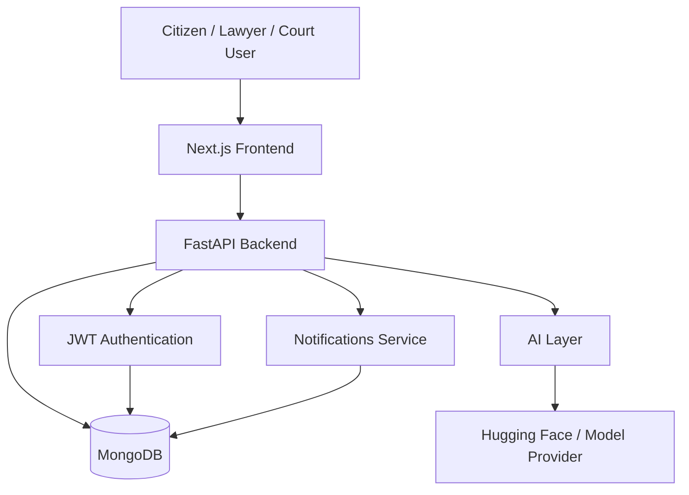
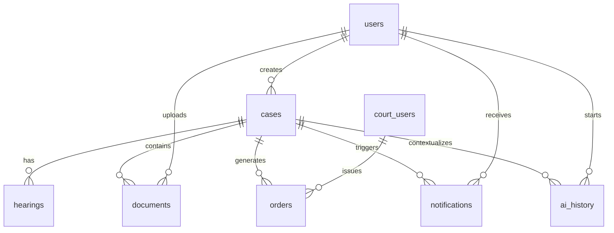
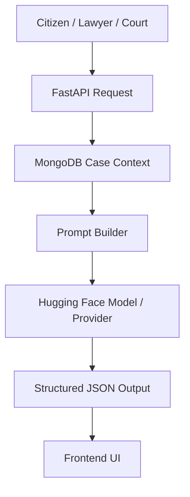

# CaseMind

> **AI-Powered Judicial Operating System**

CaseMind is a role-based judicial workflow platform for **Citizens, Lawyers, and Courts**. It combines case management, document handling, hearing timelines, evidence review, notifications, legal research, and AI-assisted case intelligence into one secure system.

The goal is not to replace judicial decision-making. The goal is to reduce friction around it: fewer paper bottlenecks, faster information retrieval, better case context, and clearer workflow visibility for every role in the system.

<!-- Badges -->

[](#)
[](#)
[](#)
[](#)
[](#)
[](#)
[](#)
[](#license)
[](#)

---

## Table of Contents

- [Overview](#overview)
- [Vision](#vision)
- [Key Features](#key-features)
  - [Citizen Portal](#citizen-portal)
  - [Lawyer Portal](#lawyer-portal)
  - [Court Portal](#court-portal)
  - [AI Features](#ai-features)
- [Screenshots](#screenshots)
- [Demo](#demo)
- [System Architecture](#system-architecture)
- [Technology Stack](#technology-stack)
- [Folder Structure](#folder-structure)
- [Architecture Decisions](#architecture-decisions)
- [Installation](#installation)
- [Environment Variables](#environment-variables)
- [API Documentation](#api-documentation)
- [Database Design](#database-design)
- [Authentication & Authorization](#authentication--authorization)
- [AI Pipeline](#ai-pipeline)
- [Security](#security)
- [Performance](#performance)
- [Accessibility](#accessibility)
- [Error Handling](#error-handling)
- [Testing](#testing)
- [Roadmap](#roadmap)
- [Future Vision](#future-vision)
- [Contribution Guide](#contribution-guide)
- [Coding Standards](#coding-standards)
- [Known Limitations](#known-limitations)
- [FAQ](#faq)
- [Acknowledgements](#acknowledgements)
- [Team](#team)
- [License](#license)
- [Support](#support)
- [Star History](#star-history)
- [Footer](#footer)

---

## Overview

Judicial systems are often slowed down by the same problems that modern software solved years ago: fragmented records, repeated manual work, poor search, delayed communication, and limited visibility into the real state of a case.

CaseMind is designed around that gap.

### The problems it targets

- Paper-based workflows that make files slow to retrieve and difficult to audit
- Slow document retrieval across FIRs, annexures, petitions, and hearing records
- Fragmented communication between citizens, lawyers, and court staff
- Manual evidence management and disconnected case references
- Delayed hearings caused by poor coordination and missing context
- Lack of intelligent legal assistance that can work across documents and timelines

### How CaseMind solves them

CaseMind centralizes case data, role-specific dashboards, document workflows, timeline events, notifications, and AI assistance in a single system.

It helps each role work with the same case truth, from different perspectives:

- Citizens can file, track, and understand their cases without relying on fragmented updates
- Lawyers can manage clients, review evidence, research legal material, and prepare work faster
- Courts can oversee proceedings, cause lists, orders, and case state with better context

The result is not just digitization. It is workflow compression: less searching, less repetition, and more time spent on actual legal judgment.

---

## Vision

CaseMind’s long-term vision is to become a practical digital layer for judicial work, not a replacement for judges, advocates, or legal review.

AI is used as an assistant: it summarizes, extracts, searches, links, and drafts. Human professionals remain responsible for decisions, validation, and judicial authority.

This matters because judicial technology must be realistic. The right future is not “AI decides the case.” The right future is:

- AI helps a lawyer understand a case faster
- AI helps court staff access relevant context sooner
- AI helps citizens follow their matter more clearly
- AI reduces the clerical load around legal work without weakening accountability

In short, CaseMind aims to make judicial systems more usable, more searchable, and more responsive while keeping final authority with humans.

---

## Key Features

CaseMind is built around three role-specific portals plus a shared AI layer.

### Citizen Portal

- Secure Authentication
- File Petitions
- Upload Documents
- Hearing Timeline
- Notifications
- Case Tracking
- AI Case Summary
- Profile Management

### Lawyer Portal

- Client Management
- Case Workspace
- AI Legal Assistant
- Legal Research
- Hearing Calendar
- Evidence Management
- Document Drafting
- Smart Notes
- Notifications

### Court Portal

- Judicial Dashboard
- Cause List
- AI Bench Brief
- Pending Judgments
- Evidence Review
- Hearing Management
- Orders & Judgments
- Court Calendar
- Notifications

### AI Features

- AI Case Summaries
- Context-Aware Chat
- Legal Research
- Evidence Analysis
- AI Bench Brief
- Intelligent Prompt Builder
- Document Intelligence

---

## Screenshots

> Add your screenshots in a `docs/screenshots/` folder and replace the placeholders below.

### Landing Page


### Authentication


### Citizen Dashboard


### Lawyer Dashboard


### Court Dashboard


### Case Workspace


### AI Assistant


### Bench Brief


---

## Demo

> Replace these placeholders with live URLs or embedded assets when available.

### Live Demo

- URL: `https://your-demo-url.example`

### Video Walkthrough

- URL: `https://your-video-url.example`

### Hackathon Presentation

- URL: `https://your-presentation-url.example`

---

## System Architecture

CaseMind uses a modular monorepo structure:

Frontend renders the user experience.

↓

Backend serves authentication, workflows, dashboards, AI orchestration, and database operations.

↓

MongoDB stores users, cases, hearings, documents, notifications, and AI history.

↓

AI layer builds prompts, manages context, and generates structured assistance.

↓

Authentication validates roles and tokens.

↓

Notifications keep users informed about case movement and workflow events.



---

## Technology Stack

### Frontend

| Technology | Purpose |
|---|---|
| Next.js | App routing, server rendering, and production frontend architecture |
| React | UI composition and state-driven interactions |
| TypeScript | Type safety across the frontend codebase |
| Tailwind CSS | Utility-first styling and layout system |
| shadcn/ui | Accessible component patterns and primitives |
| Framer Motion | Motion, transitions, and polished interaction design |

### Backend

| Technology | Purpose |
|---|---|
| FastAPI | REST API framework and service orchestration |
| Motor | Async MongoDB driver |
| Pydantic | Validation and schema modelling |
| JWT | Authentication tokens and role claims |
| Passlib | Password hashing and verification |

### Database

| Technology | Purpose |
|---|---|
| MongoDB | Case records, user accounts, hearing data, documents, notifications, and AI history |

### AI

| Technology | Purpose |
|---|---|
| Hugging Face | Model hosting / inference provider target |
| Prompt Builder | Converts case context into structured AI inputs |
| Structured JSON | Makes responses machine-readable for the UI |

### Authentication

| Technology | Purpose |
|---|---|
| JWT | Stateless auth and role propagation |

### Deployment

| Layer | Example |
|---|---|
| Frontend | Vercel / Node hosting |
| Backend | Uvicorn / containerized FastAPI service |
| Database | MongoDB Atlas |

### Developer Tools

| Tool | Purpose |
|---|---|
| Git | Version control |
| GitHub | Source hosting and collaboration |
| Cursor | AI-assisted development |
| VS Code | Primary editor |

---

## Folder Structure

```text
Casemind/
├── README.md
├── casemind-app/
│   ├── .env.example
│   ├── next.config.ts
│   ├── package.json
│   ├── public/
│   └── src/
│       ├── app/
│       │   ├── auth/
│       │   └── dashboard/
│       ├── components/
│       │   ├── auth/
│       │   ├── dashboard/
│       │   ├── layout/
│       │   ├── sections/
│       │   └── ui/
│       ├── lib/
│       └── models/
├── casemind-backend/
│   ├── .env.example
│   ├── app/
│   │   ├── api/
│   │   │   ├── ai/
│   │   │   ├── cases/
│   │   │   ├── court/
│   │   │   ├── dashboard/
│   │   │   ├── documents/
│   │   │   ├── hearings/
│   │   │   ├── lawyer/
│   │   │   ├── notifications/
│   │   │   ├── petitions/
│   │   │   ├── routes/
│   │   │   └── timeline/
│   │   ├── core/
│   │   ├── main.py
│   │   └── models/
│   └── test_mongo.py
└── uploads/
```

### What each folder does

- `casemind-app/src/app/` - frontend routes, landing page, authentication, and dashboards
- `casemind-app/src/components/` - reusable UI for auth, layout, dashboard, and marketing sections
- `casemind-app/src/lib/` - client helpers, API wrapper, and database helpers
- `casemind-app/src/models/` - frontend model definitions
- `casemind-backend/app/api/` - REST routers, schemas, and services
- `casemind-backend/app/core/` - configuration, auth, database, and storage helpers
- `casemind-backend/app/models/` - shared backend schemas
- `uploads/` - file storage for uploaded documents and evidence

---

## Architecture Decisions

### FastAPI

FastAPI is a strong fit for judicial workflows because it is async-friendly, schema-driven, and easy to organize into clear service boundaries.

### MongoDB

MongoDB fits the domain because legal records are document-shaped, timeline-heavy, and heterogeneous. Case metadata, notes, hearings, and documents do not always share a rigid relational structure.

### JWT

JWT keeps authentication stateless, which simplifies frontend integration and role-based access control across citizen, lawyer, and court portals.

### Role-Based Access

The product is fundamentally role-specific. A citizen should not see the same controls as a judge or a lawyer. The role model keeps workflows clear and permissions explicit.

### React Query

React Query is a sensible choice for production data fetching because the app has dashboard-style views, repeated server reads, loading states, and cacheable case data.

### Next.js App Router

The App Router gives the frontend server components, nested layouts, route grouping, and a clean path to role-specific interfaces.

### Modular Monolith

The backend is intentionally organized as a modular monolith. That keeps the system understandable for a hackathon MVP while preserving clear boundaries for future extraction.

### Hugging Face

Hugging Face is a practical AI hosting and inference target for a judicial product because it supports model portability, structured prompts, and future provider flexibility.

---

## Installation

### Prerequisites

- Node.js 20 or later
- Python 3.14 or later
- MongoDB instance or MongoDB Atlas connection string
- Git

### Clone

```bash
git clone https://github.com/debarghyaray7-dotcom/Casemind.git
cd Casemind
```

### Install Backend

```bash
cd casemind-backend
python -m venv venv
source venv/bin/activate
pip install fastapi uvicorn motor pymongo pydantic-settings python-jose[cryptography] passlib[bcrypt] httpx
```

### Install Frontend

```bash
cd ../casemind-app
npm install
```

### Configure Environment Variables

Create the runtime env files from the provided examples:

```bash
cp casemind-app/.env.example casemind-app/.env.local
cp casemind-backend/.env.example casemind-backend/.env
```

### Run Backend

```bash
cd casemind-backend
source venv/bin/activate
uvicorn app.main:app --reload --host 0.0.0.0 --port 8000
```

### Run Frontend

```bash
cd casemind-app
npm run dev
```

### Production Build

Frontend:

```bash
cd casemind-app
npm run build
npm run start
```

Backend:

```bash
cd casemind-backend
uvicorn app.main:app --host 0.0.0.0 --port 8000
```

---

## Environment Variables

### Backend

| Variable | Required | Description |
|---|---|---|
| `JWT_SECRET` | Yes | Secret used to sign JWT access tokens |
| `JWT_ALGORITHM` | Yes | JWT signing algorithm, usually `HS256` |
| `ACCESS_TOKEN_EXPIRE_MINUTES` | Yes | Access token lifetime in minutes |
| `MONGODB_URI` | Yes | MongoDB connection string for backend services |
| `DATABASE_NAME` | Yes | Database name used for all collections |
| `HF_API_KEY` | Optional | Hugging Face API key for AI inference |
| `HF_MODEL` | Optional | Hugging Face model identifier used by the AI layer |
| `FRONTEND_URL` | Recommended | Frontend origin for CORS / redirects in production |
| `BACKEND_PORT` | Optional | Runtime port used by the backend service |

### Frontend

| Variable | Required | Description |
|---|---|---|
| `NEXT_PUBLIC_API_URL` | Recommended | Public API base URL used by the frontend |
| `NEXT_PUBLIC_APP_NAME` | Recommended | Display name shown in UI and meta tags |

> Note: the current MVP codebase already includes example env files for the working local setup. The table above documents the full production-ready variable surface for the repository.

---

## API Documentation

The backend is organized by domain. The most important modules are below.

### Authentication

- `POST /api/auth/citizen/signup` - register a citizen
- `POST /api/auth/citizen/login` - citizen login
- `POST /api/auth/lawyer/signup` - register a lawyer
- `POST /api/auth/lawyer/login` - lawyer login
- `POST /api/auth/register` - create a court account
- `POST /api/auth/login` - court login
- `GET /api/auth/me` - return the authenticated user profile
- `POST /api/auth/logout` - client-side logout helper
- `POST /api/auth/refresh-token` - issue a fresh access token

### Citizen

- Case discovery and self-service workspaces
- Petition filing
- Document uploads
- Timeline access
- Notification visibility

### Lawyer

- Client management
- Case workspace access
- Evidence review
- Calendar and notifications
- AI-assisted work surfaces

### Court

- Court account management
- Court-facing dashboards
- Secure role-specific workflow entry points

### AI

- Chat assistant scoped to a case context
- Case summary generation
- Prompt assembly for structured legal intelligence

### Documents

- Upload, store, and retrieve legal documents and evidence
- Feed AI analysis and case context

### Notifications

- Push case updates, hearing changes, and workflow alerts to the right role

### Dashboard

- Serve role-specific operational summaries and recent activity

### Health Check

- `GET /health` - simple service health response

---

## Database Design

CaseMind uses MongoDB collections that map to real judicial entities.

### Collections

| Collection | Purpose |
|---|---|
| `users` | Citizen accounts |
| `court_users` | Court staff / court accounts |
| `cases` | Core case records and metadata |
| `hearings` | Hearing schedules and updates |
| `documents` | Uploaded legal documents and annexures |
| `notifications` | Alerts and workflow messages |
| `orders` | Court orders and judgments |
| `ai_history` | AI conversations, summaries, and generated outputs |

### Relationship Diagram



---

## Authentication & Authorization

CaseMind uses a JWT-based authentication model with role-aware access control.

### JWT

The backend issues signed JWT access tokens containing the subject and role claims.

### Password Hashing

Passwords are hashed with Passlib before storage.

### Role-Based Access Control

The platform separates access by role:

- **Citizen** - self-service case visibility and filing
- **Lawyer** - client, evidence, drafting, and research tools
- **Court** - judicial workflow and court operations

### Protected Routes

Route handlers validate the current token and reject unauthorized access.

### Token Validation

Token validation is handled on the backend before user-specific data is returned.

---

## AI Pipeline

The AI layer is designed to assist, not decide.



### How it works

1. The user opens a case-aware workflow from the frontend.
2. FastAPI loads case context from MongoDB.
3. A prompt builder composes a structured request.
4. The AI provider returns grounded output.
5. The response is normalized into machine-readable form.
6. The frontend displays the result inside the relevant workflow.

### Important principle

AI is advisory only. It is used to summarize, organize, search, and assist. It does not replace legal reasoning, court authority, or human review.

---

## Security

CaseMind applies security controls that are appropriate for sensitive legal workflows:

- Password Hashing
- JWT
- Protected APIs
- Backend-only AI Keys
- Environment Variables
- Input Validation
- Secure File Upload
- Role Validation
- CORS

---

## Performance

The architecture is optimized around fast user-facing workflows:

- React Query for client-side caching and refetch management
- Lazy loading for route-level UX
- Server Components where the Next.js architecture benefits from them
- Optimized Mongo queries around case and timeline retrieval
- Async FastAPI endpoints for non-blocking backend work
- Caching strategy for repeated dashboard and AI interactions

---

## Accessibility

CaseMind is designed to remain usable across devices and input styles.

- Responsive layouts
- Keyboard navigation
- ARIA-aware UI patterns
- High-contrast visual design
- Mobile-friendly dashboard surfaces

---

## Error Handling

Reliable legal software needs calm failure states, not broken screens.

- Loading States
- Retry States
- Empty States
- Meaningful Errors
- Backend Logging

---

## Testing

The current repository is a hackathon MVP, but the intended testing surface is clear:

- Future Unit Tests
- API Tests
- Frontend Tests
- Integration Tests

Recommended coverage areas:

- Authentication and token validation
- Role-based route access
- Case and timeline endpoints
- AI prompt assembly and response formatting
- Document upload validation

---

## Roadmap

### Completed

- [x] Authentication
- [x] Citizen Portal
- [x] Lawyer Dashboard
- [x] Backend
- [x] AI Foundation
- [x] MongoDB

### In Progress

- [ ] Court Dashboard
- [ ] AI Bench Brief
- [ ] Evidence Review

### Planned

- [ ] Case Workspace
- [ ] Real-time Notifications
- [ ] OCR
- [ ] Court Scheduling

### Future

- [ ] RAG
- [ ] Voice Assistant
- [ ] Multilingual Support
- [ ] Analytics
- [ ] Video Hearings
- [ ] E-Signatures
- [ ] Court Integrations

---

## Future Vision

Over the next five years, CaseMind can evolve into a broader digital layer for legal work and court operations.

The realistic path forward is not automation for its own sake. It is measurable productivity gains in places where judicial systems are overloaded:

- AI that helps legal professionals read and connect information faster
- Digital courts that reduce paperwork and improve transparency
- Better legal research surfaces for practitioners and staff
- Court automation for repetitive administrative tasks
- Public access tools that help citizens understand their cases

CaseMind should grow by improving clarity, not by overpromising autonomy.

---

## Contribution Guide

### Branch Naming

- `feat/<short-description>`
- `fix/<short-description>`
- `docs/<short-description>`
- `refactor/<short-description>`

### Commit Style

Use concise, imperative commit messages:

- `Add case timeline UI`
- `Fix court auth flow`
- `Document environment variables`

### Folder Conventions

- Keep route logic in `app/api/...`
- Keep reusable UI in `src/components/...`
- Keep shared helpers in `src/lib/` or `app/core/`
- Keep schemas close to the feature they support

### Coding Standards

- Prefer explicit names over abbreviations
- Keep backend route handlers thin
- Move domain logic into services
- Keep frontend components focused and reusable
- Avoid hardcoded secrets and environment values

### Pull Requests

- Explain the user-facing impact
- Link the issue or task
- Include screenshots for UI changes
- Include API examples for backend changes

### Issue Templates

- Bug report
- Feature request
- Design improvement
- Documentation request

### Review Process

- Validate the behavior locally
- Check role-specific flows
- Confirm security-sensitive changes carefully
- Keep changes scoped and understandable

---

## Coding Standards

### Backend

- Use FastAPI routers and service layers
- Keep schemas in Pydantic models
- Validate inputs before touching the database
- Return consistent error responses

### Frontend

- Use component-driven composition
- Keep role-based screens separated
- Favor readable layout primitives over deeply nested markup
- Keep asynchronous data access predictable

### Naming

- Use clear domain names: `case`, `hearing`, `document`, `notification`, `timeline`
- Use role names consistently: `citizen`, `lawyer`, `court`

### Formatting

- TypeScript: standard project formatting
- Python: standard PEP 8 style
- Markdown: short sections, tables, and callouts where useful

### Linting

- Frontend: ESLint
- Backend: keep code style consistent with the existing Python modules

---

## Known Limitations

CaseMind is currently a **Hackathon MVP**, so a few parts are intentionally minimal or placeholder-driven:

- Some demo content and UI surfaces are still mock-like
- Production deployment and secrets management are not fully configured in-repo
- Several roadmap items are planned but not implemented yet
- AI provider integration is still evolving toward a more flexible provider abstraction
- Some backend modules are structured for future workflows that are not fully complete

That is expected for an MVP. The system is built to show the architecture and the product direction clearly.

---

## FAQ

<details>
<summary>What is CaseMind?</summary>

CaseMind is an AI-powered judicial operating system for citizens, lawyers, and courts.
</details>

<details>
<summary>Is CaseMind replacing judges or lawyers?</summary>

No. It is designed to assist legal professionals and improve workflow visibility, not replace legal judgment.
</details>

<details>
<summary>What problem does it solve?</summary>

It reduces the friction of legal work by centralizing documents, timelines, notifications, evidence, and AI assistance.
</details>

<details>
<summary>What roles are supported?</summary>

Citizen, Lawyer, and Court.
</details>

<details>
<summary>What database does it use?</summary>

MongoDB.
</details>

<details>
<summary>What powers the backend?</summary>

FastAPI with async MongoDB access and JWT authentication.
</details>

<details>
<summary>Does the AI use case context?</summary>

Yes. Case-aware prompts are built from MongoDB data before AI generation.
</details>

<details>
<summary>Can it be deployed in production?</summary>

Yes, but the current repository is still a hackathon MVP and will need production hardening.
</details>

<details>
<summary>Is the repository monolithic or modular?</summary>

It is a modular monorepo with a frontend app and a backend service.
</details>

<details>
<summary>Where should screenshots go?</summary>

Put them in `docs/screenshots/` and update the placeholder image paths.
</details>

---

## Acknowledgements

- Next.js
- FastAPI
- MongoDB
- React
- TypeScript
- Framer Motion
- Tailwind CSS
- Pydantic
- Motor
- Passlib
- The open-source communities behind these tools

---

## Team

- **Project Lead:** Himanshu
- **Contributors:** Add contributor names here
- **Mentors:** Add mentor names here

---

## License

This project is licensed under the [MIT License](LICENSE).

---

## Support

- GitHub Issues: use the repository issue tracker
- Email: support@example.com

---

## Star History

> Add a star history chart here if you want to track project growth over time.

---

## Footer

CaseMind is an AI-powered Judicial Operating System designed to improve legal workflows through responsible AI, modern software engineering, and human-centered design.
